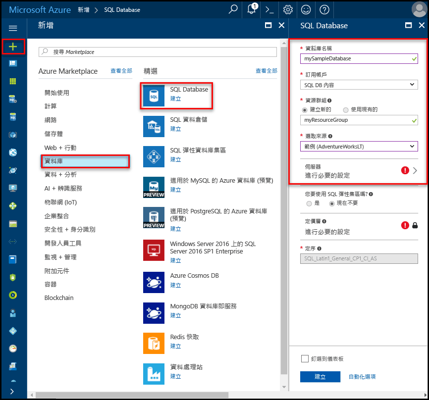

# 建立和管理 Azure SQL Database 伺服器與資料庫

Azure SQL Database 是在 Microsoft Azure 中在 [Azure 資源群組](../azure-resource-manager/resource-group-overview.md) 內建立的一種受管理資料庫，且[針對不同工作負載定義好一組運算和儲存資源](sql-database-service-tiers.md)。 Azure SQL Database 與 Azure SQL Database 邏輯伺服器相關聯，後者在特定的 Azure 區域內建立。 

## Azure SQL Database 可以是單一、集區或分割的資料庫

Azure SQL Database 可以是：

- 單一資料庫包含其[自有資源集](sql-database-what-is-a-dtu.md#what-are-database-transaction-units-dtus) (DTU)
- [共用一組資源集](sql-database-what-is-a-dtu.md#what-are-elastic-database-transaction-units-edtus) (eDTU) 之 [SQL 彈性集區](sql-database-elastic-pool.md)的一部分
- [分區化資料庫向外延展集](sql-database-elastic-scale-introduction.md#horizontal-and-vertical-scaling)的一部分，可以是單一或集區資料庫
- 參與[多租用戶 SaaS 設計模式](sql-database-design-patterns-multi-tenancy-saas-applications.md)的資料庫集一部分，其資料庫可以是單一值或集區資料庫 (或兩者) 

> [!TIP]
> 如需有效的資料庫名稱，請參閱[資料庫識別碼](https://docs.microsoft.com/en-us/sql/relational-databases/databases/database-identifiers)。 
>
 
- 使用 Microsoft Azure SQL Database 的 hello 預設資料庫定序是**SQL_LATIN1_GENERAL_CP1_CI_AS**，其中**LATIN1_GENERAL**是英文 （美國） **CP1**是字碼頁 1252， **CI**不區分大小寫，和**AS**區分腔調字。 如需有關如何 tooset hello 定序的詳細資訊，請參閱[COLLATE (TRANSACT-SQL)](https://msdn.microsoft.com/library/ms184391.aspx)。
- Microsoft Azure SQL Database 支援表格式資料流 (TDS) 通訊協定用戶端 7.3 版或更新版本。
- 僅允許 TCP/IP 連線。

## 什麼是 Azure SQL 邏輯伺服器？

邏輯伺服器作為多個資料庫的中央管理點，包括 [SQL 彈性集區](sql-database-elastic-pool.md)[登入](sql-database-manage-logins.md)、[防火牆規則](sql-database-firewall-configure.md)、[稽核規則](sql-database-auditing.md)、[威脅偵測原則](sql-database-threat-detection.md)和[容錯移轉群組](sql-database-geo-replication-overview.md)。 邏輯伺服器可以位於與其資源群組不同的區域中。 hello 邏輯伺服器必須存在才能建立 hello Azure SQL database。 在伺服器上的所有資料庫中都建立 hello 相同與 hello 邏輯伺服器的區域。 

> [!IMPORTANT]
> SQL 資料庫中是一個邏輯結構，您可能要熟悉 hello 在內部部署的世界中的 SQL Server 執行個體不同的伺服器。 具體來說，hello SQL Database 服務不保證 hello 資料庫的位置以關聯 tootheir 邏輯伺服器，並公開 （expose） 任何執行個體層級存取權或功能。
> 

當您建立的邏輯伺服器時，提供伺服器登入帳戶和密碼具有該伺服器上的系統管理權限 toohello master 資料庫和該伺服器上建立的所有資料庫。 這個初始帳戶是 SQL 登入帳戶。 Azure SQL Database 支援 SQL 驗證和 Azure Active Directory 驗證來進行驗證。 如需登入和驗證的相關資訊，請參閱[管理 Azure SQL Database 的資料庫和登入](sql-database-manage-logins.md)。 不支援 Windows 驗證。 

> [!TIP]
> 如需有效的資源群組和伺服器名稱，請參閱[命名規則和限制](https://docs.microsoft.com/azure/architecture/best-practices/naming-conventions)。
>

Azure 資料庫邏輯伺服器：

- 會建立在 Azure 訂用帳戶，但是可以移動它所包含的資源 tooanother 訂用帳戶
- Hello 父資源資料庫、 彈性集區，和資料倉儲
- 提供資料庫的命名空間、彈性集區和資料倉儲
- 是強式存留期語意-刪除伺服器，而且已刪除的邏輯容器 hello 自主的資料庫，彈性集區和資料倉儲
- 參與[Azure 角色型存取控制 (RBAC)](/active-directory/role-based-access-control-what-is) -資料庫、 彈性集區，以及在伺服器中的資料倉儲的存取權限繼承 hello 伺服器
- 是 hello 身分識別的資料庫、 彈性集區和 Azure 資源的資料倉儲的高序位項目管理目的而 (請參閱 hello URL 配置的資料庫和集區)
- 區域中的共置資源
- 提供用來存取資料庫的連接端點 (<serverName>.database.windows.net)
- 提供有關連接 tooa master 資料庫 Dmv 透過包含資源的存取 toometadata 
- 提供管理原則，套用 tooits 資料庫-登入、 防火牆、 稽核、 威脅偵測等等的 hello 的範圍。 
- Hello 父訂用帳戶內的配額會限制 (每個訂用帳戶預設為六部伺服器[查看訂用帳戶限制以下](../azure-subscription-service-limits.md))
- 提供 hello 資源 （例如 45000 DTU) 包含的資料庫配額與 DTU 配額的 hello 範圍
- 包含資源上啟用功能的 hello 版本範圍 
- 伺服器層級主體登入可以管理伺服器上的所有資料庫
- 可以包含登入授與被授與存取 tooone 或 hello 伺服器上的多個資料庫，而且可以是內部部署上的 SQL Server 執行個體中的類似 toothose 有限的系統管理權限。 如需詳細資訊，請參閱[登入](sql-database-manage-logins.md)。

## Azure SQL Database 受 SQL Database 防火牆保護

toohelp 保護您的資料， [SQL Database 防火牆](sql-database-firewall-configure.md)可防止所有存取 tooyour 資料庫伺服器或任何從資料庫外部連接 toohello 伺服器直接透過您的 Azure 訂用帳戶連線。 tooenable 其他連線，您必須[建立一或多個防火牆規則](sql-database-firewall-configure.md#creating-and-managing-firewall-rules)。 如需建立和管理 SQL 彈性集區，請參閱[彈性集區](sql-database-elastic-pool.md)。

## 管理 Azure SQL 伺服器、 資料庫和防火牆使用 hello Azure 入口網站

您可以建立 hello Azure SQL database 的資源群組事先或在建立 hello 伺服器本身時。 有多個方法來取得 tooa 新 SQL server 的表單建立新的 SQL server，或是做為建立新資料庫的一部分。 

### 建立空白的 SQL Server (邏輯伺服器)

Azure SQL Database 伺服器 （不含資料庫的資料庫） 使用 toocreate hello [Azure 入口網站](https://portal.azure.com)，瀏覽 tooa 空白 SQL server （邏輯伺服器） 格式。 hello 下列螢幕擷取畫面顯示一個方法開啟表單 toocreate 空白的邏輯 SQL server。 

   

如果您收到 toothis 表單使用其他方法，hello hello 表單上的資訊是完全相同。

### 建立空白或範例 SQL 資料庫

Azure SQL 資料庫使用 toocreate hello [Azure 入口網站](https://portal.azure.com)，瀏覽 tooa 空白 SQL Database 的表單，並提供 hello 要求的資訊。 您可以建立 hello Azure SQL 資料庫的資源群組和事先或在建立 hello 資料庫本身時，邏輯伺服器。 您可以建立空白資料庫，或建立根據 Adventure Works LT 的範例資料庫。 

  

> [重要]如需選取 hello 定價層為您的資料庫資訊，請參閱[服務層](sql-database-service-tiers.md)。
>

### 管理現有的 SQL Server

toomanage 現有的伺服器，瀏覽 toohello 伺服器使用的一些方法-例如來自特定的 SQL database 頁面 hello **SQL 伺服器** 頁面上或使用 hello**所有資源**頁面。 hello 下列螢幕擷取畫面顯示如何設定伺服器層級防火牆設定從 hello toobegin**概觀**伺服器頁面。 

   

toomanage 現有的資料庫中，瀏覽 toohello **SQL 資料庫**頁面上，按一下您想 toomanage hello 資料庫。 hello 下列螢幕擷取畫面顯示如何設定資料庫的伺服器層級防火牆設定從 hello toobegin**概觀**資料庫頁面。 

    

> [!IMPORTANT]
> tooconfigure 效能屬性是資料庫，請參閱[服務層](sql-database-service-tiers.md)。
>

> [!TIP]
> Azure 入口網站快速入門教學課程中，請參閱[hello Azure 入口網站中建立 Azure SQL database](sql-database-get-started-portal.md)。
>

## 使用 PowerShell 管理 Azure SQL 伺服器、資料庫和防火牆

toocreate 及管理 Azure SQL server、 資料庫和使用 Azure PowerShell 的防火牆，請使用下列 PowerShell 指令程式的 hello。 如果您需要 tooinstall 或升級 PowerShell 時，請參閱[安裝 Azure PowerShell 模組](/powershell/azure/install-azurerm-ps)。 如需建立和管理 SQL 彈性集區，請參閱[彈性集區](sql-database-elastic-pool.md)。

| Cmdlet | 說明 |
| --- | --- |
|[New-AzureRmSqlDatabase](/powershell/module/azurerm.sql/new-azurermsqldatabase)|建立資料庫 |
|[Get-AzureRmSqlDatabase](/powershell/module/azurerm.sql/get-azurermsqldatabase)|取得一或多個資料庫|
|[Set-AzureRmSqlDatabase](/powershell/module/azurerm.sql/set-azurermsqldatabase)|設定資料庫的屬性，或將現有資料庫移到彈性集區中|
|[Remove-AzureRmSqlDatabase](/powershell/module/azurerm.sql/remove-azurermsqldatabase)|移除資料庫|
|[New-AzureRmResourceGroup](/powershell/module/azurerm.resources/new-azurermresourcegroup)|建立資源群組
|[New-AzureRmSqlServer](/powershell/module/azurerm.sql/new-azurermsqlserver)|建立伺服器|
|[Get-AzureRmSqlServer](/powershell/module/azurerm.sql/get-azurermsqlserver)|傳回伺服器的相關資訊|
|[Set-AzureRmSqlServer](https://docs.microsoft.com/en-us/powershell/module/azurerm.sql/set-azurermsqlserver)|修改伺服器的屬性|
|[Remove-AzureRmSqlServer](/powershell/module/azurerm.sql/remove-azurermsqlserver)|移除伺服器|
|[New-AzureRmSqlServerFirewallRule](/powershell/module/azurerm.sql/new-azurermsqlserverfirewallrule)|建立伺服器層級防火牆規則 |
|[Get-AzureRmSqlServerFirewallRule](/powershell/module/azurerm.sql/get-azurermsqlserverfirewallrule)|取得伺服器的防火牆規則|
|[Set-AzureRmSqlServerFirewallRule](/powershell/module/azurerm.sql/set-azurermsqlserverfirewallrule)|修改伺服器中的防火牆規則|
|[Remove-AzureRmSqlServerFirewallRule](/powershell/module/azurerm.sql/remove-azurermsqlserverfirewallrule)|刪除伺服器的防火牆規則|

> [!TIP]
> 如需 PowerShell 快速入門教學課程，請參閱[使用 PowerShell 建立單一 Azure SQL Database](sql-database-get-started-portal.md)。 PowerShell 範例指令碼，請參閱[使用 PowerShell toocreate 單一的 Azure SQL 資料庫，並設定防火牆規則](scripts/sql-database-create-and-configure-database-powershell.md)和[監視器和調整規模為單一的 SQL 資料庫使用 PowerShell](scripts/sql-database-monitor-and-scale-database-powershell.md)。
>

## 管理 Azure SQL 伺服器、 資料庫和使用 Azure CLI hello 的防火牆

toocreate 和管理 Azure SQL server、 資料庫和防火牆以 hello [Azure CLI](/cli/azure/overview)，使用 hello 下列[Azure CLI SQL Database](/cli/azure/sql/db)命令。 使用 hello[雲端殼層](/azure/cloud-shell/overview)toorun hello CLI，瀏覽或[安裝](/cli/azure/install-azure-cli)到 macOS、 Linux 或 Windows。 如需建立和管理 SQL 彈性集區，請參閱[彈性集區](sql-database-elastic-pool.md)。

| Cmdlet | 說明 |
| --- | --- |
|[az sql db create](/cli/azure/sql/db#create) |建立資料庫|
|[az sql db list](/cli/azure/sql/db#list)|列出伺服器中的所有資料庫和資料倉儲，或彈性集區中的所有資料庫|
|[az sql db list-editions](/cli/azure/sql/db#list-editions)|列出可用的服務目標與儲存體限制|
|[az sql db list-usages](/cli/azure/sql/db#list-usages)|傳回資料庫使用方式|
|[az sql db show](/cli/azure/sql/db#show)|取得資料庫或資料倉儲|
|[az sql db update](/cli/azure/sql/db#update)|更新資料庫|
|[az sql db delete](/cli/azure/sql/db#delete)|移除資料庫|
|[az group create](/cli/azure/group#create)|建立資源群組|
|[az sql server create](/cli/azure/sql/server#create)|建立伺服器|
|[az sql server list](/cli/azure/sql/server#list)|列出伺服器|
|[az sql server list-usages](/cli/azure/sql/server#list-usages)|傳回伺服器使用方式|
|[az sql server show](/cli/azure/sql/server#show)|取得伺服器|
|[az sql server update](/cli/azure/sql/server#update)|更新伺服器|
|[az sql server delete](/cli/azure/sql/server#delete)|刪除伺服器|
|[az sql server firewall-rule create](/cli/azure/sql/server/firewall-rule#create)|建立伺服器防火牆規則|
|[az sql server firewall-rule list](/cli/azure/sql/server/firewall-rule#list)|列出伺服器上的 hello 防火牆規則|
|[az sql server firewall-rule show](/cli/azure/sql/server/firewall-rule#show)|顯示 hello 的防火牆規則的詳細資料|
|[az sql server firewall-rule update](/cli/azure/sql/server/firewall-rule#update)|更新防火牆規則|
|[az sql server firewall-rule delete](/cli/azure/sql/server/firewall-rule#delete)|刪除防火牆規則|

> [!TIP]
> Azure CLI 快速入門教學課程中，請參閱[建立單一的 Azure SQL database，使用 Azure CLI hello](sql-database-get-started-cli.md)。 針對 Azure CLI 範例指令碼，請參閱[使用 CLI toocreate 單一的 Azure SQL 資料庫，並設定防火牆規則](scripts/sql-database-create-and-configure-database-cli.md)和[使用 CLI toomonitor 和小數位數單一的 SQL database](scripts/sql-database-monitor-and-scale-database-cli.md)。
>

## 使用 Transact-SQL 管理 Azure SQL 伺服器、資料庫和防火牆

toocreate 及管理 Azure SQL server、 資料庫以及使用 TRANSACT-SQL 的防火牆，請使用下列 T-SQL 命令 hello。 您可以發出這些命令使用 hello Azure 入口網站[SQL Server Management Studio](/sql/ssms/use-sql-server-management-studio)， [Visual Studio Code](https://code.visualstudio.com/docs)，或是任何其他程式可以連接 tooan Azure SQL Database 伺服器，並傳遞 Transact SQL命令。 如需管理 SQL 彈性集區，請參閱[彈性集區](sql-database-elastic-pool.md)。

> [!IMPORTANT]
> 您無法使用 Transact-SQL 建立或刪除伺服器。
>

| 命令 | 說明 |
| --- | --- |
|[CREATE DATABASE (Azure SQL Database)](/sql/t-sql/statements/create-database-azure-sql-database)|建立新的資料庫。 您必須是連接的 toohello master 資料庫 toocreate 新的資料庫。|
| [ALTER DATABASE (Azure SQL Database)](/sql/t-sql/statements/alter-database-azure-sql-database) |修改 Azure SQL Database。 |
|[ALTER DATABASE (Azure SQL Data Warehouse)](/sql/t-sql/statements/alter-database-azure-sql-data-warehouse)|修改 Azure SQL 資料倉儲。|
|[DROP DATABASE (Transact-SQL)](/sql/t-sql/statements/drop-database-transact-sql)|刪除資料庫。|
|[sys.database_service_objectives (Azure SQL Database)](/sql/relational-databases/system-catalog-views/sys-database-service-objectives-azure-sql-database)|傳回 hello edition （服務層）、 （定價層） 的服務目標和彈性集區名稱，如果有的話，Azure SQL database 或 Azure SQL 資料倉儲。 如果登入 toohello master 資料庫中的 Azure SQL Database 伺服器，傳回所有資料庫相關資訊。 Azure SQL 資料倉儲，您必須連接的 toohello master 資料庫。|
|[sys.dm_db_resource_stats (Azure SQL Database)](/sql/relational-databases/system-dynamic-management-views/sys-dm-db-resource-stats-azure-sql-database)| 傳回 Azure SQL Database 資料庫的 CPU、I/O 和記憶體耗用量。 即使在 hello 資料庫中沒有任何活動每 15 秒，有一個資料列。|
|[sys.resource_stats (Azure SQL Database)](/sql/relational-databases/system-catalog-views/sys-resource-stats-azure-sql-database)|傳回 Azure SQL Database 的 CPU 使用量和儲存體資料。 hello 資料收集和彙總五分鐘間隔內。|
|[sys.database_connection_stats (Azure SQL Database)](/sql/relational-databases/system-catalog-views/sys-database-connection-stats-azure-sql-database)|包含 SQL Database 資料庫連線事件的統計資料，提供資料庫連接成功和失敗的概觀。 |
|[sys.event_log (Azure SQL Database)](/sql/relational-databases/system-catalog-views/sys-event-log-azure-sql-database)|傳回成功的 Azure SQL Database 資料庫連接、連接失敗和死結。 您可以使用此資訊 tootrack 或疑難排解 SQL Database 的資料庫活動。|
|[sp_set_firewall_rule (Azure SQL Database)](/sql/relational-databases/system-stored-procedures/sp-set-firewall-rule-azure-sql-database)|建立或更新您的 SQL 資料庫伺服器的 hello 伺服器層級防火牆設定。 這個預存程序僅供以 hello master 資料庫 toohello 伺服器層級主體登入。 伺服器層級防火牆規則只能建立 hello 第一個伺服器層級防火牆規則已建立具有 Azure 層級權限的使用者之後使用 TRANSACT-SQL|
|[sys.firewall_rules (Azure SQL Database)](/sql/relational-databases/system-catalog-views/sys-firewall-rules-azure-sql-database)|傳回與您的 Microsoft Azure SQL Database 相關聯的 hello 伺服器層級防火牆設定的相關資訊。|
|[sp_delete_firewall_rule (Azure SQL Database)](/sql/relational-databases/system-stored-procedures/sp-delete-firewall-rule-azure-sql-database)|移除 SQL Database 伺服器的伺服器層級防火牆設定。 這個預存程序僅供以 hello master 資料庫 toohello 伺服器層級主體登入。|
|[sp_set_database_firewall_rule (Azure SQL Database)](/sql/relational-databases/system-stored-procedures/sp-set-database-firewall-rule-azure-sql-database)|建立或更新您的 Azure SQL Database 或 SQL 資料倉儲的 hello 資料庫層級防火牆規則。 資料庫防火牆規則可以在 hello master 資料庫，以及 SQL Database 上的使用者資料庫的設定。 使用自主資料庫使用者時，資料庫防火牆規則很有用。 |
|[sys.database_firewall_rules (Azure SQL Database)](/sql/relational-databases/system-catalog-views/sys-database-firewall-rules-azure-sql-database)|傳回與您的 Microsoft Azure SQL Database 相關聯的 hello 資料庫層級防火牆設定的相關資訊。 |
|[sp_delete_database_firewall_rule (Azure SQL Database)](/sql/relational-databases/system-stored-procedures/sp-delete-database-firewall-rule-azure-sql-database)|移除您的 Azure SQL Database 或 SQL 資料倉儲的資料庫層級防火牆設定。 |

> [!TIP]
> Microsoft Windows 上使用 SQL Server Management Studio 的快速入門教學課程，請參閱[Azure SQL Database： 使用 SQL Server Management Studio tooconnect 和查詢資料](sql-database-connect-query-ssms.md)。 如需 hello macOS、 Linux 或 Windows 上使用 Visual Studio 程式碼快速入門教學課程，請參閱[Azure SQL Database： 使用 Visual Studio 程式碼 tooconnect 和查詢資料](sql-database-connect-query-vscode.md)。

## 管理 Azure SQL 伺服器、 資料庫和使用 hello REST API 的防火牆

toocreate 和管理 Azure SQL server、 資料庫和使用 hello REST API 的防火牆，請參閱[Azure SQL Database REST API](/rest/api/sql/)。

## 後續步驟

- toolearn 有關共用資料庫使用 SQL 彈性集區，請參閱[彈性集區](sql-database-elastic-pool.md)。
- Hello Azure SQL Database 服務的相關資訊，請參閱[SQL Database 是什麼？](sql-database-technical-overview.md)。
- toolearn 有關移轉 SQL Server 資料庫 tooAzure，請參閱[移轉 tooAzure SQL Database](sql-database-cloud-migrate.md)。
- 如需支援功能的相關資訊，請參閱「[功能](sql-database-features.md)」。
