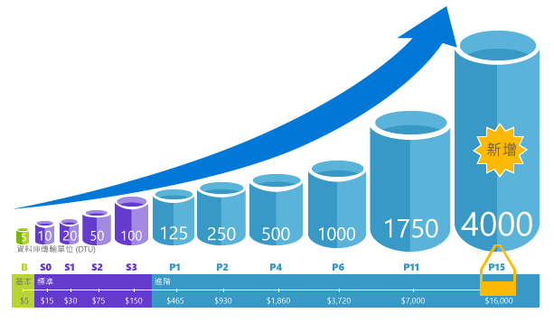
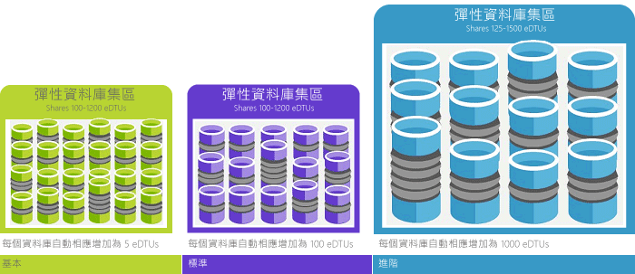

# 說明資料庫交易單位 (DTU) 和彈性資料庫交易單位 (eDTU)Explaining Database Transaction Units (DTUs) and elastic Database Transaction Units (eDTUs)
本文說明資料庫交易單位 (Dtu) 和彈性資料庫交易單位 (Edtu) 及您叫用時，會發生什麼事 hello 最大 Dtu 或是 Edtu。This article explains Database Transaction Units (DTUs) and elastic Database Transaction Units (eDTUs) and what happens when you hit hello maximum DTUs or eDTUs.  

## 何謂資料庫交易單位 (DTU)What are Database Transaction Units (DTUs)
單一 Azure SQL database 在特定的效能層級內[服務層](sql-database-service-tiers.md#single-database-service-tiers-and-performance-levels)，Microsoft 保證特定層級的資源，該資料庫 （獨立於任何其他資料庫 hello Azure 雲端中），並提供可預測的效能層級。For a single Azure SQL database at a specific performance level within a [service tier](sql-database-service-tiers.md#single-database-service-tiers-and-performance-levels), Microsoft guarantees a certain level of resources for that database (independent of any other database in hello Azure cloud) and providing a predictable level of performance. 此資源數量會計算為資料庫交易單位 (DTU) 數量，且為 CPU、記憶體、I/O (資料與交易記錄 I/O) 的混合測量。This amount of resources is calculated as a number of Database Transaction Units or DTUs, and is a blended measure of CPU, memory, I/O (data and transaction log I/O). 原本由 hello 這些資源之間的比率[OLTP 基準測試工作負載](sql-database-benchmark-overview.md)設計 toobe 典型的真實世界 OLTP 工作負載。hello ratio amongst these resources was originally determined by an [OLTP benchmark workload](sql-database-benchmark-overview.md) designed toobe typical of real-world OLTP workloads. 您的工作負載超過任何這些資源的 hello 數量，您的輸送量時，節流-產生速度較慢的效能和逾時。When your workload exceeds hello amount of any of these resources, your throughput is throttled - resulting in slower performance and timeouts. 您的工作負載所使用的 hello 資源不會影響 hello 資源可用 tooother hello Azure 的雲端中的 SQL 資料庫和 hello 的其他工作負載所使用的資源不會影響 hello 資源可用 tooyour SQL 資料庫。hello resources used by your workload do not impact hello resources available tooother SQL databases in hello Azure cloud, and hello resource used by other workloads do not impact hello resources available tooyour SQL database.

Dtu 是最適用於了解 hello 相對資源數量不同的效能層級的 Azure SQL Database 服務層之間。DTUs are most useful for understanding hello relative amount of resources between Azure SQL Databases at different performance levels and service tiers. 例如，藉由增加 hello 資料庫效能層級加倍 hello Dtu 等同 toodoubling hello 一組資源可用 toothat 資料庫。For example, doubling hello DTUs by increasing hello performance level of a database equates toodoubling hello set of resource available toothat database. 例如，相較於具有 5 個 DTU 的 Basic 資料庫，具有 1750 個 DTU 的 Premium P11 資料庫可提供 350 倍的 DTU 計算能力。For example, a Premium P11 database with 1750 DTUs provides 350x more DTU compute power than a Basic database with 5 DTUs.  

toogain 深入探索您的工作負載使用 hello (DTU) 的資源耗用量[Azure SQL 資料庫查詢效能深入解析](sql-database-query-performance.md)至：toogain deeper insight into hello resource (DTU) consumption of your workload, use [Azure SQL Database Query Performance Insight](sql-database-query-performance.md) to:

- 識別 hello 排名最前面查詢依 CPU/期間執行計數可能會改善效能進行微調。Identify hello top queries by CPU/Duration/Execution count that can potentially be tuned for improved performance. 例如，I/O 密集的查詢可能會受益的 hello 使用[記憶體中最佳化技巧](sql-database-in-memory.md)toomake 更有效地使用 hello 可用記憶體，在某些服務層和效能層級。For example, an I/O intensive query might benefit from hello use of [in-memory optimization techniques](sql-database-in-memory.md) toomake better use of hello available memory at a certain service tier and performance level.
- 向下鑽研至 hello 詳細資料的查詢、 檢視其文字和資源使用量的歷程記錄。Drill down into hello details of a query, view its text and history of resource utilization.
- 存取效能微調建議，其會顯示 [SQL Database Advisor](sql-database-advisor.md) 執行的動作。Access performance tuning recommendations that show actions performed by [SQL Database Advisor](sql-database-advisor.md).

您可以[來變更服務層](sql-database-service-tiers.md)隨時以最少停機時間 tooyour 應用程式 （通常平均底下 4 秒）。You can [change service tiers](sql-database-service-tiers.md) at any time with minimal downtime tooyour application (generally averaging under four seconds). 許多企業和應用程式，所能 toocreate 資料庫以及撥隨選效能向上或向下即已足夠，特別是如果使用模式是相對的可預測。For many businesses and apps, being able toocreate databases and dial performance up or down on demand is enough, especially if usage patterns are relatively predictable. 但是，如果您有無法預期的使用模式，它可更難 toomanage 成本和商務模型。But if you have unpredictable usage patterns, it can make it hard toomanage costs and your business model. 此案例中，您可以使用彈性集區與 hello 集區中的多個資料庫所共用的 Edtu 數目。For this scenario, you use an elastic pool with a certain number of eDTUs that are shared among multiple database in hello pool.

## 何謂彈性資料庫交易單位 (eDTU)What are elastic Database Transaction Units (eDTUs)
而是提供的一組專用的資源 (Dtu) tooa 遊客不論是否不需要的 SQL 資料庫，您可以將至[彈性集區](sql-database-elastic-pool.md)上共用的資源集區的 SQL Database 伺服器在這些資料庫。Rather than provide a dedicated set of resources (DTUs) tooa SQL Database that is always available regardless of whether needed not, you can place databases into an [elastic pool](sql-database-elastic-pool.md) on a SQL Database server that shares a pool of resources among those database. 彈性資料庫交易單位或 Edtu 所測量的彈性集區中的 hello 共用資源。hello shared resources in an elastic pool measured by elastic Database Transaction Units or eDTUs. 彈性集區提供符合成本效益的簡單解決方案 toomanage hello 效能目標的多個有不同的廣泛的資料庫和無法預期的使用模式。Elastic pools provide a simple cost effective solution toomanage hello performance goals for multiple databases that have widely varying and unpredictable usage patterns. 彈性集區，您可保證沒有一個資料庫使用的所有 hello 資源在 hello 集區和的資源有最小數量一律為彈性集區中的可用 tooa 資料庫。In an elastic pool, you can guarantee that no one database uses all of hello resources in hello pool and also that a minimum amount of resources is always available tooa database in an elastic pool. 如需詳細資訊，請參閱[彈性集區](sql-database-elastic-pool.md)。See  [elastic pools](sql-database-elastic-pool.md) for more information.

集區以固定價格提供固定數目的 eDTU。A pool is given a set number of eDTUs, for a set price. Hello 彈性集區中的個別資料庫會提供 hello 彈性 tooauto 延展 hello 設定界限內。Within hello elastic pool, individual databases are given hello flexibility tooauto-scale within hello configured boundaries. 負載過重，雖然在淺色負載下的資料庫耗用小於底下沒有負載的資料庫使用沒有 Edtu toohello 點設定資料庫時，可以使用 Edtu toomeet 需求。Under heavy load, a database can consume more eDTUs toomeet demand while databases under light loads consume less, up toohello point that databases under no load consume no eDTUs. 藉由佈建 hello 整個集區的資源，而非每個資料庫、 管理工作經過簡化而且您擁有 hello 集區的可預測的預算。By provisioning resources for hello entire pool, rather than per database, management tasks are simplified and you have a predictable budget for hello pool.

其他的 Edtu 可以加入 tooan 現有集區，而不會影響任何資料庫的停機時間與 hello 集區中的 hello 資料庫上。Additional eDTUs can be added tooan existing pool with no database downtime and with no impact on hello databases in hello pool. 同樣地，如果不再需要額外 eDTU，則隨時可以從現有集區中移除。Similarly, if extra eDTUs are no longer needed, they can be removed from an existing pool at any point in time. 您可以加入或減去資料庫 toohello 集區，或限制 hello 數量的 Edtu 資料庫可用於在高載量 tooreserve Edtu 其他資料庫。You can add or subtract databases toohello pool, or limit hello amount of eDTUs a database can use under heavy load tooreserve eDTUs for other databases. 如果資料庫會如預期般使用資源，您可以將它移出 hello 集區並將它設定為其所需的資源的可預測量的單一資料庫。If a database is predictably under-utilizing resources, you can move it out of hello pool and configure it as a single database with predictable amount of resources it requires.

## 如何判斷我的工作負載所需的 Dtu 的 hello 數目？How can I determine hello number of DTUs needed by my workload?
如果您要尋找 toomigrate 現有內部部署或 SQL Server 虛擬機器工作負載 tooAzure SQL 資料庫，您可以使用 hello [DTU 計算機](http://dtucalculator.azurewebsites.net/)所需的 Dtu tooapproximate hello 數目。If you are looking toomigrate an existing on-premises or SQL Server virtual machine workload tooAzure SQL Database, you can use hello [DTU Calculator](http://dtucalculator.azurewebsites.net/) tooapproximate hello number of DTUs needed. 您可以使用現有的 Azure SQL Database 工作負載[SQL 資料庫查詢效能深入解析](sql-database-query-performance.md)toounderstand 如何您資料庫資源耗用量 (Dtu) tooget 深入探索 toooptimize 您的工作負載。For an existing Azure SQL Database workload, you can use [SQL Database Query Performance Insight](sql-database-query-performance.md) toounderstand your database resource consumption (DTUs) tooget deeper insight into how toooptimize your workload. 您也可以使用 hello [sys.dm_db_ resource_stats](https://msdn.microsoft.com/library/dn800981.aspx) DMV tooget hello 資源耗用量資訊 hello 最後一個小時。You can also use hello [sys.dm_db_ resource_stats](https://msdn.microsoft.com/library/dn800981.aspx) DMV tooget hello resource consumption information for hello last one hour. 或者，hello 目錄檢視[sys.resource_stats](http://msdn.microsoft.com/library/dn269979.aspx)可以也是查詢的 tooget hello 相同的資料 hello 過去 14 天，雖然在五分鐘的平均較低精確度。Alternatively, hello catalog view [sys.resource_stats](http://msdn.microsoft.com/library/dn269979.aspx) can also be queried tooget hello same data for hello last 14 days, although at a lower fidelity of five-minute averages.

## 如何得知我能受益於彈性資源集區？How do I know if I could benefit from an elastic pool of resources?
集區適合於具備特定使用模式的大量資料庫。Pools are suited for a large number of databases with specific utilization patterns. 針對指定的資料庫，此模式的特徵是低平均使用量與相對不頻繁的使用量高峰。For a given database, this pattern is characterized by low average utilization with relatively infrequent utilization spikes. SQL Database 會自動評估 hello 歷史資源使用量中現有的 SQL 資料庫伺服器的資料庫，並且建議 hello Azure 入口網站中的 hello 適當的集區組態。SQL Database automatically evaluates hello historical resource usage of databases in an existing SQL Database server and recommends hello appropriate pool configuration in hello Azure portal. 如需詳細資訊，請參閱 [何時應該使用彈性集區？](sql-database-elastic-pool.md)For more information, see [when should an elastic pool be used?](sql-database-elastic-pool.md)

## 當我達到 DTU 上限時會發生什麼狀況What happens when I hit my maximum DTUs
制定效能層級和管的 tooprovide hello 所需資源 toorun 資料庫工作負載向上 toohello 允許您選取的服務層/效能層級的最大限制。Performance levels are calibrated and governed tooprovide hello needed resources toorun your database workload up toohello max limits allowed for your selected service tier/performance level. 如果您的工作負載叫用其中一種資料 CPU/IO/Log IO 限制 hello 限制，您在 hello 最大的允許層級繼續 tooreceive hello 資源，但可能 toosee 增加延遲對於您的查詢。If your workload is hitting hello limits in one of CPU/Data IO/Log IO limits, you continue tooreceive hello resources at hello maximum allowed level, but you are likely toosee increased latencies for your queries. 這些限制不會導致任何錯誤，但而是會降低 hello 工作負載，除非 hello 緩慢的問題變得嚴重，查詢開始時間。如果您達到最大允許並行使用者工作階段/要求 (背景工作執行緒) 的限制，您會看到明確的錯誤。These limits do not result in any errors, but rather a slowdown in hello workload, unless hello slowdown becomes so severe that queries start timing out. If you are hitting limits of maximum allowed concurrent user sessions/requests (worker threads), you see explicit errors. 如需 CPU、記憶體、資料 I/O 和交易記錄檔 I/O 以外的資源限制資訊，請參閱 [Azure SQL Database 資源限制](sql-database-resource-limits.md) 。See [Azure SQL Database resource limits](sql-database-resource-limits.md) for information on limit on resources other than CPU, memory, data I/O, and transaction log I/O.

## 後續步驟Next steps
* 請參閱[服務層](sql-database-service-tiers.md)hello 的 dtu 數及可用與彈性集區的單一資料庫的 edtu 數目上的資訊。See [Service tier](sql-database-service-tiers.md) for information on hello DTUs and eDTUs available for single databases and for elastic pools.
* 如需 CPU、記憶體、資料 I/O 和交易記錄檔 I/O 以外的資源限制資訊，請參閱 [Azure SQL Database 資源限制](sql-database-resource-limits.md) 。See [Azure SQL Database resource limits](sql-database-resource-limits.md) for information on limit on resources other than CPU, memory, data I/O, and transaction log I/O.
* 請參閱[SQL 資料庫查詢效能深入解析](sql-database-query-performance.md)toounderstand (Dtu) 取用。See [SQL Database Query Performance Insight](sql-database-query-performance.md) toounderstand your (DTUs) consumption.
* 請參閱[SQL Database 基準測試概觀](sql-database-benchmark-overview.md)toounderstand hello 方法背後 hello OLTP 基準測試工作負載使用 toodetermine hello DTU blend。See [SQL Database benchmark overview](sql-database-benchmark-overview.md) toounderstand hello methodology behind hello OLTP benchmark workload used toodetermine hello DTU blend.
