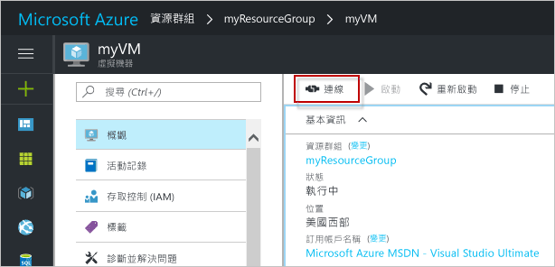

# <a name="create-a-linux-virtual-machine-with-hello-azure-portal"></a><span data-ttu-id="a4bad-103">建立 Linux 虛擬機器以 hello Azure 入口網站</span><span class="sxs-lookup"><span data-stu-id="a4bad-103">Create a Linux virtual machine with hello Azure portal</span></span>

<span data-ttu-id="a4bad-104">您可以透過 hello Azure 入口網站建立 azure 虛擬機器。</span><span class="sxs-lookup"><span data-stu-id="a4bad-104">Azure virtual machines can be created through hello Azure portal.</span></span> <span data-ttu-id="a4bad-105">此方法可提供以瀏覽器為基礎的使用者介面，以便建立和設定虛擬機器，以及所有相關的資源。</span><span class="sxs-lookup"><span data-stu-id="a4bad-105">This method provides a browser-based user interface for creating and configuring virtual machines and all related resources.</span></span> <span data-ttu-id="a4bad-106">此快速入門引導您逐步建立虛擬機器和 hello VM 上安裝 web 伺服器。</span><span class="sxs-lookup"><span data-stu-id="a4bad-106">This Quickstart steps through creating a virtual machine and installing a webserver on hello VM.</span></span>

<span data-ttu-id="a4bad-107">如果您沒有 Azure 訂用帳戶，請在開始前建立 [免費帳戶](https://azure.microsoft.com/free/?WT.mc_id=A261C142F) 。</span><span class="sxs-lookup"><span data-stu-id="a4bad-107">If you don't have an Azure subscription, create a [free account](https://azure.microsoft.com/free/?WT.mc_id=A261C142F) before you begin.</span></span>

## <a name="create-ssh-key-pair"></a><span data-ttu-id="a4bad-108">建立 SSH 金鑰組</span><span class="sxs-lookup"><span data-stu-id="a4bad-108">Create SSH key pair</span></span>

<span data-ttu-id="a4bad-109">需要 SSH 金鑰組 toocomplete 本快速入門。</span><span class="sxs-lookup"><span data-stu-id="a4bad-109">You need an SSH key pair toocomplete this quick start.</span></span> <span data-ttu-id="a4bad-110">如果現有的 SSH 金鑰組，則可略過此步驟。</span><span class="sxs-lookup"><span data-stu-id="a4bad-110">If you have an existing SSH key pair, this step can be skipped.</span></span>

<span data-ttu-id="a4bad-111">從 Bash 殼層中，執行此命令，並遵循螢幕上指示 hello。</span><span class="sxs-lookup"><span data-stu-id="a4bad-111">From a Bash shell, run this command and follow hello on-screen directions.</span></span> <span data-ttu-id="a4bad-112">hello 命令輸出會包含 hello hello 公開金鑰檔案的檔案名稱。</span><span class="sxs-lookup"><span data-stu-id="a4bad-112">hello command output includes hello file name of hello public key file.</span></span> <span data-ttu-id="a4bad-113">將複製 hello hello 公開金鑰檔案 toohello 剪貼簿內容。</span><span class="sxs-lookup"><span data-stu-id="a4bad-113">Copy hello contents of hello public key file toohello clipboard.</span></span>

```bash
ssh-keygen -t rsa -b 2048
```

## <a name="log-in-tooazure"></a><span data-ttu-id="a4bad-114">登入 tooAzure</span><span class="sxs-lookup"><span data-stu-id="a4bad-114">Log in tooAzure</span></span> 

<span data-ttu-id="a4bad-115">登入 toohello http://portal.azure.com 在 Azure 入口網站。</span><span class="sxs-lookup"><span data-stu-id="a4bad-115">Log in toohello Azure portal at http://portal.azure.com.</span></span>

## <a name="create-virtual-machine"></a><span data-ttu-id="a4bad-116">Create virtual machine</span><span class="sxs-lookup"><span data-stu-id="a4bad-116">Create virtual machine</span></span>

1. <span data-ttu-id="a4bad-117">按一下 hello**新增**hello 的左上角 hello Azure 入口網站上找到的按鈕。</span><span class="sxs-lookup"><span data-stu-id="a4bad-117">Click hello **New** button found on hello upper left-hand corner of hello Azure portal.</span></span>

2. <span data-ttu-id="a4bad-118">選取 [計算]，然後選取 [Ubuntu Server 16.04 LTS]。</span><span class="sxs-lookup"><span data-stu-id="a4bad-118">Select **Compute**, and then select **Ubuntu Server 16.04 LTS**.</span></span> 

3. <span data-ttu-id="a4bad-119">輸入 hello 虛擬機器資訊。</span><span class="sxs-lookup"><span data-stu-id="a4bad-119">Enter hello virtual machine information.</span></span> <span data-ttu-id="a4bad-120">針對 [驗證類型] 選取 [SSH 公開金鑰]。</span><span class="sxs-lookup"><span data-stu-id="a4bad-120">For **Authentication type**, select **SSH public key**.</span></span> <span data-ttu-id="a4bad-121">貼上的 SSH 公開金鑰，格外謹慎 tooremove 任何開頭或尾端泛空白字元。</span><span class="sxs-lookup"><span data-stu-id="a4bad-121">When pasting in your SSH public key, take care tooremove any leading or trailing white space.</span></span> <span data-ttu-id="a4bad-122">完成時，按一下 [確定]。</span><span class="sxs-lookup"><span data-stu-id="a4bad-122">When complete, click **OK**.</span></span>

    

4. <span data-ttu-id="a4bad-124">選取 hello VM 的大小。</span><span class="sxs-lookup"><span data-stu-id="a4bad-124">Select a size for hello VM.</span></span> <span data-ttu-id="a4bad-125">多個的大小，選取 toosee**檢視所有**或變更 hello**支援磁碟類型**篩選器。</span><span class="sxs-lookup"><span data-stu-id="a4bad-125">toosee more sizes, select **View all** or change hello **Supported disk type** filter.</span></span> 

      

5. <span data-ttu-id="a4bad-127">Hello 設定 刀鋒視窗上保留 hello 預設值，然後按一下**確定**。</span><span class="sxs-lookup"><span data-stu-id="a4bad-127">On hello settings blade, keep hello defaults and click **OK**.</span></span>

6. <span data-ttu-id="a4bad-128">在 hello 摘要 頁面上，按一下 **確定**toostart hello 虛擬機器部署。</span><span class="sxs-lookup"><span data-stu-id="a4bad-128">On hello summary page, click **Ok** toostart hello virtual machine deployment.</span></span>

7. <span data-ttu-id="a4bad-129">hello VM 將會是已釘選的 toohello Azure 入口網站的儀表板。</span><span class="sxs-lookup"><span data-stu-id="a4bad-129">hello VM will be pinned toohello Azure portal dashboard.</span></span> <span data-ttu-id="a4bad-130">Hello 部署完成後，請 hello VM 摘要刀鋒視窗會自動開啟。</span><span class="sxs-lookup"><span data-stu-id="a4bad-130">Once hello deployment has completed, hello VM summary blade automatically opens.</span></span>


## <a name="connect-toovirtual-machine"></a><span data-ttu-id="a4bad-131">Toovirtual 機器連線</span><span class="sxs-lookup"><span data-stu-id="a4bad-131">Connect toovirtual machine</span></span>

<span data-ttu-id="a4bad-132">建立 SSH 連線與 hello 虛擬機器。</span><span class="sxs-lookup"><span data-stu-id="a4bad-132">Create an SSH connection with hello virtual machine.</span></span>

1. <span data-ttu-id="a4bad-133">按一下 hello**連接**hello 虛擬機器刀鋒視窗上的按鈕。</span><span class="sxs-lookup"><span data-stu-id="a4bad-133">Click hello **Connect** button on hello virtual machine blade.</span></span> <span data-ttu-id="a4bad-134">hello 連接 按鈕會顯示使用的 tooconnect toohello 虛擬機器的 SSH 連接字串。</span><span class="sxs-lookup"><span data-stu-id="a4bad-134">hello connect button displays an SSH connection string that can be used tooconnect toohello virtual machine.</span></span>

     

2. <span data-ttu-id="a4bad-136">Hello 執行的下列命令 toocreate SSH 工作階段。</span><span class="sxs-lookup"><span data-stu-id="a4bad-136">Run hello following command toocreate an SSH session.</span></span> <span data-ttu-id="a4bad-137">Hello 以取代連接字串 hello 一個您所複製的 hello Azure 入口網站。</span><span class="sxs-lookup"><span data-stu-id="a4bad-137">Replace hello connection string with hello one you copied from hello Azure portal.</span></span>

```bash 
ssh azureuser@40.112.21.50
```

## <a name="install-nginx"></a><span data-ttu-id="a4bad-138">安裝 NGINX</span><span class="sxs-lookup"><span data-stu-id="a4bad-138">Install NGINX</span></span>

<span data-ttu-id="a4bad-139">使用 hello 以下撞指令碼 tooupdate 封裝來源，並安裝最新 NGINX 套件 hello。</span><span class="sxs-lookup"><span data-stu-id="a4bad-139">Use hello following bash script tooupdate package sources and install hello latest NGINX package.</span></span> 

```bash 
#!/bin/bash

# update package source
sudo apt-get -y update

# install NGINX
sudo apt-get -y install nginx
```

<span data-ttu-id="a4bad-140">完成之後，結束 hello SSH 工作階段，傳回 hello Azure 入口網站中的 hello VM 屬性。</span><span class="sxs-lookup"><span data-stu-id="a4bad-140">When done, exit hello SSH session and return hello VM properties in hello Azure portal.</span></span>


## <a name="open-port-80-for-web-traffic"></a><span data-ttu-id="a4bad-141">針對 Web 流量開啟連接埠 80</span><span class="sxs-lookup"><span data-stu-id="a4bad-141">Open port 80 for web traffic</span></span> 

<span data-ttu-id="a4bad-142">網路安全性群組 (NSG) 可保護輸入和輸出流量。</span><span class="sxs-lookup"><span data-stu-id="a4bad-142">A Network security group (NSG) secures inbound and outbound traffic.</span></span> <span data-ttu-id="a4bad-143">從 hello Azure 入口網站建立 VM 時，輸入的規則就會建立 SSH 連線的通訊埠 22。</span><span class="sxs-lookup"><span data-stu-id="a4bad-143">When a VM is created from hello Azure portal, an inbound rule is created on port 22 for SSH connections.</span></span> <span data-ttu-id="a4bad-144">因為此 VM 裝載的網頁伺服器時，NSG 規則需要 toobe 建立的連接埠 80。</span><span class="sxs-lookup"><span data-stu-id="a4bad-144">Because this VM hosts a webserver, an NSG rule needs toobe created for port 80.</span></span>

1. <span data-ttu-id="a4bad-145">Hello 虛擬機器上，按一下 hello hello 名稱**資源群組**。</span><span class="sxs-lookup"><span data-stu-id="a4bad-145">On hello virtual machine, click hello name of hello **Resource group**.</span></span>
2. <span data-ttu-id="a4bad-146">選取 hello**網路安全性群組**。</span><span class="sxs-lookup"><span data-stu-id="a4bad-146">Select hello **network security group**.</span></span> <span data-ttu-id="a4bad-147">hello NSG 可以使用來識別 hello**類型**資料行。</span><span class="sxs-lookup"><span data-stu-id="a4bad-147">hello NSG can be identified using hello **Type** column.</span></span> 
3. <span data-ttu-id="a4bad-148">在 hello 左側功能表中，在 設定 上按一下**輸入安全性規則**。</span><span class="sxs-lookup"><span data-stu-id="a4bad-148">On hello left-hand menu, under settings, click **Inbound security rules**.</span></span>
4. <span data-ttu-id="a4bad-149">按一下 [新增]。</span><span class="sxs-lookup"><span data-stu-id="a4bad-149">Click on **Add**.</span></span>
5. <span data-ttu-id="a4bad-150">在 [名稱] 中輸入 **http**。</span><span class="sxs-lookup"><span data-stu-id="a4bad-150">In **Name**, type **http**.</span></span> <span data-ttu-id="a4bad-151">請確定**連接埠範圍**設定 too80 和**動作**設定得**允許**。</span><span class="sxs-lookup"><span data-stu-id="a4bad-151">Make sure **Port range** is set too80 and **Action** is set too**Allow**.</span></span> 
6. <span data-ttu-id="a4bad-152">按一下 [確定] 。</span><span class="sxs-lookup"><span data-stu-id="a4bad-152">Click **OK**.</span></span>


## <a name="view-hello-nginx-welcome-page"></a><span data-ttu-id="a4bad-153">檢視 hello NGINX 歡迎使用 頁面</span><span class="sxs-lookup"><span data-stu-id="a4bad-153">View hello NGINX welcome page</span></span>

<span data-ttu-id="a4bad-154">NGINX 安裝，且連接埠 80 開啟 tooyour VM、 hello 網頁伺服器現在可以從 hello 存取網際網路。</span><span class="sxs-lookup"><span data-stu-id="a4bad-154">With NGINX installed, and port 80 open tooyour VM, hello webserver can now be accessed from hello internet.</span></span> <span data-ttu-id="a4bad-155">開啟網頁瀏覽器，並輸入 hello VM 的 hello 公用 IP 位址。</span><span class="sxs-lookup"><span data-stu-id="a4bad-155">Open a web browser, and enter hello public IP address of hello VM.</span></span> <span data-ttu-id="a4bad-156">hello 公用 IP 位址可以找到 hello hello Azure 入口網站中的 VM 刀鋒視窗。</span><span class="sxs-lookup"><span data-stu-id="a4bad-156">hello public IP address can be found on hello VM blade in hello Azure portal.</span></span>

 

## <a name="clean-up-resources"></a><span data-ttu-id="a4bad-158">清除資源</span><span class="sxs-lookup"><span data-stu-id="a4bad-158">Clean up resources</span></span>

<span data-ttu-id="a4bad-159">當不再需要請刪除 hello 資源群組、 虛擬機器和相關的所有資源。</span><span class="sxs-lookup"><span data-stu-id="a4bad-159">When no longer needed, delete hello resource group, virtual machine, and all related resources.</span></span> <span data-ttu-id="a4bad-160">toodo 因此從 hello 虛擬機器刀鋒視窗中選取 hello 資源群組，然後按一下**刪除**。</span><span class="sxs-lookup"><span data-stu-id="a4bad-160">toodo so, select hello resource group from hello virtual machine blade and click **Delete**.</span></span>

## <a name="next-steps"></a><span data-ttu-id="a4bad-161">後續步驟</span><span class="sxs-lookup"><span data-stu-id="a4bad-161">Next steps</span></span>

<span data-ttu-id="a4bad-162">在此快速入門中，您已部署簡單的虛擬機器、網路安全性群組規則，並已安裝 Web 伺服器。</span><span class="sxs-lookup"><span data-stu-id="a4bad-162">In this quick start, you’ve deployed a simple virtual machine, a network security group rule, and installed a web server.</span></span> <span data-ttu-id="a4bad-163">進一步了解 Azure 虛擬機器，toolearn 繼續 toohello 教學課程適用於 Linux Vm。</span><span class="sxs-lookup"><span data-stu-id="a4bad-163">toolearn more about Azure virtual machines, continue toohello tutorial for Linux VMs.</span></span>

> [!div class="nextstepaction"]
> [<span data-ttu-id="a4bad-164">Azure Linux 虛擬機器教學課程</span><span class="sxs-lookup"><span data-stu-id="a4bad-164">Azure Linux virtual machine tutorials</span></span>](./tutorial-manage-vm.md)
