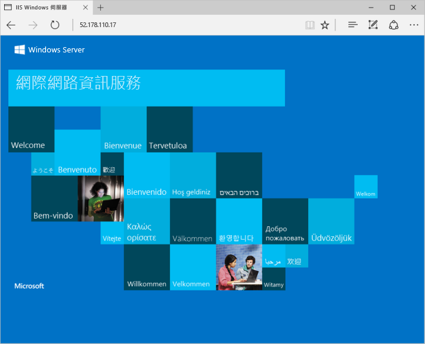

# <a name="create-a-windows-virtual-machine-with-hello-azure-cli"></a><span data-ttu-id="7fe44-103">建立 Windows 虛擬機器以 hello Azure CLI</span><span class="sxs-lookup"><span data-stu-id="7fe44-103">Create a Windows virtual machine with hello Azure CLI</span></span>

<span data-ttu-id="7fe44-104">hello Azure CLI 會使用的 toocreate 和管理 Azure 資源，從 hello 命令列或指令碼中。</span><span class="sxs-lookup"><span data-stu-id="7fe44-104">hello Azure CLI is used toocreate and manage Azure resources from hello command line or in scripts.</span></span> <span data-ttu-id="7fe44-105">執行 Windows Server 2016 的虛擬機器使用 hello Azure CLI toodeploy 本指南詳述。</span><span class="sxs-lookup"><span data-stu-id="7fe44-105">This guide details using hello Azure CLI toodeploy a virtual machine running Windows Server 2016.</span></span> <span data-ttu-id="7fe44-106">當部署完成之後，我們 toohello 伺服器連接，並安裝 IIS。</span><span class="sxs-lookup"><span data-stu-id="7fe44-106">Once deployment is complete, we connect toohello server and install IIS.</span></span>

<span data-ttu-id="7fe44-107">如果您沒有 Azure 訂用帳戶，請在開始前建立 [免費帳戶](https://azure.microsoft.com/free/?WT.mc_id=A261C142F) 。</span><span class="sxs-lookup"><span data-stu-id="7fe44-107">If you don't have an Azure subscription, create a [free account](https://azure.microsoft.com/free/?WT.mc_id=A261C142F) before you begin.</span></span>


[!INCLUDE [cloud-shell-try-it.md](../../../includes/cloud-shell-try-it.md)]

<span data-ttu-id="7fe44-108">如果您選擇 tooinstall，並在本機上使用 hello CLI，本快速入門會要求執行 hello Azure CLI 版本 2.0.4 或更新版本。</span><span class="sxs-lookup"><span data-stu-id="7fe44-108">If you choose tooinstall and use hello CLI locally, this quickstart requires that you are running hello Azure CLI version 2.0.4 or later.</span></span> <span data-ttu-id="7fe44-109">執行`az --version`toofind hello 版本。</span><span class="sxs-lookup"><span data-stu-id="7fe44-109">Run `az --version` toofind hello version.</span></span> <span data-ttu-id="7fe44-110">如果您需要 tooinstall 或升級，請參閱[安裝 Azure CLI 2.0]( /cli/azure/install-azure-cli)。</span><span class="sxs-lookup"><span data-stu-id="7fe44-110">If you need tooinstall or upgrade, see [Install Azure CLI 2.0]( /cli/azure/install-azure-cli).</span></span> 


## <a name="create-a-resource-group"></a><span data-ttu-id="7fe44-111">建立資源群組</span><span class="sxs-lookup"><span data-stu-id="7fe44-111">Create a resource group</span></span>

<span data-ttu-id="7fe44-112">使用 [az group create](/cli/azure/group#create) 來建立資源群組。</span><span class="sxs-lookup"><span data-stu-id="7fe44-112">Create a resource group with [az group create](/cli/azure/group#create).</span></span> <span data-ttu-id="7fe44-113">Azure 資源群組是在其中部署與管理 Azure 資源的邏輯容器。</span><span class="sxs-lookup"><span data-stu-id="7fe44-113">An Azure resource group is a logical container into which Azure resources are deployed and managed.</span></span> 

<span data-ttu-id="7fe44-114">hello 下列範例會建立名為的資源群組*myResourceGroup*在 hello *eastus*位置。</span><span class="sxs-lookup"><span data-stu-id="7fe44-114">hello following example creates a resource group named *myResourceGroup* in hello *eastus* location.</span></span>

```azurecli-interactive 
az group create --name myResourceGroup --location eastus
```

## <a name="create-virtual-machine"></a><span data-ttu-id="7fe44-115">Create virtual machine</span><span class="sxs-lookup"><span data-stu-id="7fe44-115">Create virtual machine</span></span>

<span data-ttu-id="7fe44-116">使用 [az vm create](/cli/azure/vm#create) 來建立 VM。</span><span class="sxs-lookup"><span data-stu-id="7fe44-116">Create a VM with [az vm create](/cli/azure/vm#create).</span></span> 

<span data-ttu-id="7fe44-117">hello 下列範例會建立名為的 VM *myVM*。</span><span class="sxs-lookup"><span data-stu-id="7fe44-117">hello following example creates a VM named *myVM*.</span></span> <span data-ttu-id="7fe44-118">這個範例會使用*azureuser*系統管理使用者名稱和*myPassword12* hello 密碼。</span><span class="sxs-lookup"><span data-stu-id="7fe44-118">This example uses *azureuser* for an administrative user name and *myPassword12* as hello password.</span></span> <span data-ttu-id="7fe44-119">更新這些值 toosomething 適當 tooyour 環境。</span><span class="sxs-lookup"><span data-stu-id="7fe44-119">Update these values toosomething appropriate tooyour environment.</span></span> <span data-ttu-id="7fe44-120">與 hello 虛擬機器建立的連接時，會需要這些值。</span><span class="sxs-lookup"><span data-stu-id="7fe44-120">These values are needed when creating a connection with hello virtual machine.</span></span>

```azurecli-interactive 
az vm create --resource-group myResourceGroup --name myVM --image win2016datacenter --admin-username azureuser --admin-password myPassword12
```

<span data-ttu-id="7fe44-121">建立 hello VM 後，hello Azure CLI 顯示資訊的類似 toohello 下列範例。</span><span class="sxs-lookup"><span data-stu-id="7fe44-121">When hello VM has been created, hello Azure CLI shows information similar toohello following example.</span></span> <span data-ttu-id="7fe44-122">記下 hello `publicIpAaddress`。</span><span class="sxs-lookup"><span data-stu-id="7fe44-122">Take note of hello `publicIpAaddress`.</span></span> <span data-ttu-id="7fe44-123">此位址為使用的 tooaccess hello VM。</span><span class="sxs-lookup"><span data-stu-id="7fe44-123">This address is used tooaccess hello VM.</span></span>

```azurecli-interactive 
{
  "fqdns": "",
  "id": "/subscriptions/d5b9d4b7-6fc1-0000-0000-000000000000/resourceGroups/myResourceGroup/providers/Microsoft.Compute/virtualMachines/myVM",
  "location": "eastus",
  "macAddress": "00-0D-3A-23-9A-49",
  "powerState": "VM running",
  "privateIpAddress": "10.0.0.4",
  "publicIpAddress": "52.174.34.95",
  "resourceGroup": "myResourceGroup"
}
```

## <a name="open-port-80-for-web-traffic"></a><span data-ttu-id="7fe44-124">針對 Web 流量開啟連接埠 80</span><span class="sxs-lookup"><span data-stu-id="7fe44-124">Open port 80 for web traffic</span></span> 

<span data-ttu-id="7fe44-125">預設只有 RDP 連線允許 tooWindows 虛擬機器部署在 Azure 中。</span><span class="sxs-lookup"><span data-stu-id="7fe44-125">By default only RDP connections are allowed in tooWindows virtual machines deployed in Azure.</span></span> <span data-ttu-id="7fe44-126">如果此 VM 將會 toobe web 伺服器，您需要從網際網路 hello tooopen 連接埠 80。</span><span class="sxs-lookup"><span data-stu-id="7fe44-126">If this VM is going toobe a webserver, you need tooopen port 80 from hello Internet.</span></span> <span data-ttu-id="7fe44-127">使用 hello [az vm 開啟通訊埠](/cli/azure/vm#open-port)命令 tooopen hello 所需的連接埠。</span><span class="sxs-lookup"><span data-stu-id="7fe44-127">Use hello [az vm open-port](/cli/azure/vm#open-port) command tooopen hello desired port.</span></span>  
 
 ```azurecli-interactive  
az vm open-port --port 80 --resource-group myResourceGroup --name myVM
```


## <a name="connect-toovirtual-machine"></a><span data-ttu-id="7fe44-128">Toovirtual 機器連線</span><span class="sxs-lookup"><span data-stu-id="7fe44-128">Connect toovirtual machine</span></span>

<span data-ttu-id="7fe44-129">使用 hello 下列命令 toocreate 與 hello 虛擬機器的遠端桌面工作階段。</span><span class="sxs-lookup"><span data-stu-id="7fe44-129">Use hello following command toocreate a remote desktop session with hello virtual machine.</span></span> <span data-ttu-id="7fe44-130">取代 hello 公用 IP 位址的虛擬機器中的 hello IP 位址。</span><span class="sxs-lookup"><span data-stu-id="7fe44-130">Replace hello IP address with hello public IP address of your virtual machine.</span></span> <span data-ttu-id="7fe44-131">出現提示時，輸入 hello 建立 hello 虛擬機器時使用的認證。</span><span class="sxs-lookup"><span data-stu-id="7fe44-131">When prompted, enter hello credentials used when creating hello virtual machine.</span></span>

```bash 
mstsc /v:<Public IP Address>
```

## <a name="install-iis-using-powershell"></a><span data-ttu-id="7fe44-132">使用 PowerShell 安裝 IIS</span><span class="sxs-lookup"><span data-stu-id="7fe44-132">Install IIS using PowerShell</span></span>

<span data-ttu-id="7fe44-133">既然您已登入 toohello Azure VM，您可以使用單行 PowerShell tooinstall IIS，並啟用 hello 本機防火牆規則 tooallow web 流量。</span><span class="sxs-lookup"><span data-stu-id="7fe44-133">Now that you have logged in toohello Azure VM, you can use a single line of PowerShell tooinstall IIS and enable hello local firewall rule tooallow web traffic.</span></span> <span data-ttu-id="7fe44-134">開啟 PowerShell 命令提示字元並執行下列命令的 hello:</span><span class="sxs-lookup"><span data-stu-id="7fe44-134">Open a PowerShell prompt and run hello following command:</span></span>

```powershell
Install-WindowsFeature -name Web-Server -IncludeManagementTools
```

## <a name="view-hello-iis-welcome-page"></a><span data-ttu-id="7fe44-135">檢視 hello IIS [歡迎使用] 頁面</span><span class="sxs-lookup"><span data-stu-id="7fe44-135">View hello IIS welcome page</span></span>

<span data-ttu-id="7fe44-136">安裝 IIS 和現在 hello 網際網路從 VM 上開啟連接埠 80，您可以使用網頁瀏覽器，您的選擇 tooview hello 預設 IIS 歡迎使用頁面。</span><span class="sxs-lookup"><span data-stu-id="7fe44-136">With IIS installed and port 80 now open on your VM from hello Internet, you can use a web browser of your choice tooview hello default IIS welcome page.</span></span> <span data-ttu-id="7fe44-137">為確定 toouse hello 公用 IP 位址您 toovisit hello 預設頁面上面所記載。</span><span class="sxs-lookup"><span data-stu-id="7fe44-137">Be sure toouse hello public IP address you documented above toovisit hello default page.</span></span> 

 

## <a name="clean-up-resources"></a><span data-ttu-id="7fe44-139">清除資源</span><span class="sxs-lookup"><span data-stu-id="7fe44-139">Clean up resources</span></span>

<span data-ttu-id="7fe44-140">當不再需要您可以使用 hello [az 群組刪除](/cli/azure/group#delete)命令 tooremove hello 資源群組、 VM 和所有相關的資源。</span><span class="sxs-lookup"><span data-stu-id="7fe44-140">When no longer needed, you can use hello [az group delete](/cli/azure/group#delete) command tooremove hello resource group, VM, and all related resources.</span></span>

```azurecli-interactive 
az group delete --name myResourceGroup
```

## <a name="next-steps"></a><span data-ttu-id="7fe44-141">後續步驟</span><span class="sxs-lookup"><span data-stu-id="7fe44-141">Next steps</span></span>

<span data-ttu-id="7fe44-142">在此快速入門中，您已部署簡單的虛擬機器、網路安全性群組規則，並已安裝 Web 伺服器。</span><span class="sxs-lookup"><span data-stu-id="7fe44-142">In this quick start, you’ve deployed a simple virtual machine, a network security group rule, and installed a web server.</span></span> <span data-ttu-id="7fe44-143">進一步了解 Azure 虛擬機器，toolearn 繼續 toohello 教學課程適用於 Windows Vm。</span><span class="sxs-lookup"><span data-stu-id="7fe44-143">toolearn more about Azure virtual machines, continue toohello tutorial for Windows VMs.</span></span>

> [!div class="nextstepaction"]
> [<span data-ttu-id="7fe44-144">Azure Windows 虛擬機器教學課程</span><span class="sxs-lookup"><span data-stu-id="7fe44-144">Azure Windows virtual machine tutorials</span></span>](./tutorial-manage-vm.md)
