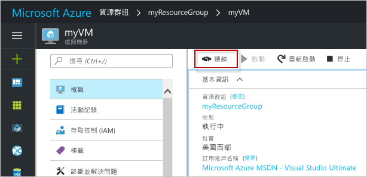
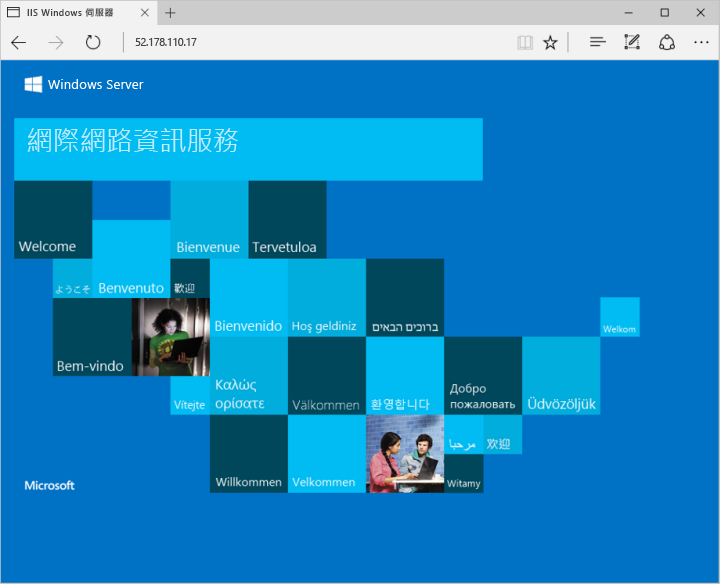

# <a name="create-a-windows-virtual-machine-with-hello-azure-portal"></a>建立 Windows 虛擬機器以 hello Azure 入口網站

您可以透過 hello Azure 入口網站建立 azure 虛擬機器。 此方法可提供以瀏覽器為基礎的使用者介面，以便建立和設定虛擬機器，以及所有相關的資源。 此快速入門引導您逐步建立虛擬機器和 hello VM 上安裝 web 伺服器。

如果您沒有 Azure 訂用帳戶，請在開始前建立 [免費帳戶](https://azure.microsoft.com/free/?WT.mc_id=A261C142F) 。

## <a name="log-in-tooazure"></a>登入 tooAzure

登入 toohello http://portal.azure.com 在 Azure 入口網站。

## <a name="create-virtual-machine"></a>Create virtual machine

1. 按一下 hello**新增**hello 的左上角 hello Azure 入口網站上找到的按鈕。

2. 選取 [計算]，然後選取 [Windows Server 2016 Datacenter]。 

3. 輸入 hello 虛擬機器資訊。 在此輸入 hello 使用者名稱和密碼是使用的 toolog toohello 虛擬機器中。 完成時，按一下 [確定]。

      

4. 選取 hello VM 的大小。 多個的大小，選取 toosee**檢視所有**或變更 hello**支援磁碟類型**篩選器。 

      

5. Hello 設定 刀鋒視窗上保留 hello 預設值，然後按一下**確定**。

6. 在 hello 摘要 頁面上，按一下 **確定**toostart hello 虛擬機器部署。

7. hello VM 將會是已釘選的 toohello Azure 入口網站的儀表板。 Hello 部署完成後，請 hello VM 摘要刀鋒視窗會自動開啟。


## <a name="connect-toovirtual-machine"></a>Toovirtual 機器連線

建立遠端桌面連線 toohello 虛擬機器。

1. 按一下 hello**連接**hello 虛擬機器內容 按鈕。 隨即建立並下載遠端桌面通訊協定檔案 (.rdp 檔案)。

     

2. tooconnect tooyour VM，開啟 hello 下載 RDP 檔案。 出現提示時，按一下 [連線]。 在 Mac 上，您需要這類 RDP 用戶端[遠端桌面用戶端](https://itunes.apple.com/us/app/microsoft-remote-desktop/id715768417?mt=12)從 hello Mac App Store。

3. Hello 使用者名稱和密碼建立 hello 的虛擬機器時所指定的輸入，然後按一下 **確定**。

4. 您可能會收到 hello 登入程序期間憑證警告。 按一下**是**或**繼續**tooproceed hello 連線。


## <a name="install-iis-using-powershell"></a>使用 PowerShell 安裝 IIS

Hello 虛擬機器上，啟動 PowerShell 工作階段並執行下列命令 tooinstall IIS hello。

```powershell
Install-WindowsFeature -name Web-Server -IncludeManagementTools
```

完成之後，結束 hello RDP 工作階段，傳回 hello Azure 入口網站中的 hello VM 屬性。

## <a name="open-port-80-for-web-traffic"></a>針對 Web 流量開啟連接埠 80 

網路安全性群組 (NSG) 可保護輸入和輸出流量。 從 hello Azure 入口網站建立 VM 時，連接埠 3389 RDP 連線就會建立輸入的規則。 因為此 VM 裝載的網頁伺服器時，NSG 規則需要 toobe 建立的連接埠 80。

1. Hello 虛擬機器上，按一下 hello hello 名稱**資源群組**。
2. 選取 hello**網路安全性群組**。 hello NSG 可以使用來識別 hello**類型**資料行。 
3. 在 hello 左側功能表中，在 設定 上按一下**輸入安全性規則**。
4. 按一下 [新增]。
5. 在 [名稱] 中輸入 **http**。 請確定**連接埠範圍**設定 too80 和**動作**設定得**允許**。 
6. 按一下 [確定] 。


## <a name="view-hello-iis-welcome-page"></a>檢視 hello IIS [歡迎使用] 頁面

與 IIS 安裝，且連接埠 80 開啟 tooyour VM、 hello 網頁伺服器現在可以從 hello 存取網際網路。 開啟網頁瀏覽器，並輸入 hello VM 的 hello 公用 IP 位址。 hello 公用 IP 位址可以找到 hello hello Azure 入口網站中的 VM 刀鋒視窗。

 

## <a name="clean-up-resources"></a>清除資源

當不再需要請刪除 hello 資源群組、 虛擬機器和相關的所有資源。 toodo 因此從 hello 虛擬機器刀鋒視窗中選取 hello 資源群組，然後按一下**刪除**。

## <a name="next-steps"></a>後續步驟

在此快速入門中，您已部署簡單的虛擬機器、網路安全性群組規則，並已安裝 Web 伺服器。 進一步了解 Azure 虛擬機器，toolearn 繼續 toohello 教學課程適用於 Windows Vm。

> [!div class="nextstepaction"]
> [Azure Windows 虛擬機器教學課程](./tutorial-manage-vm.md)
