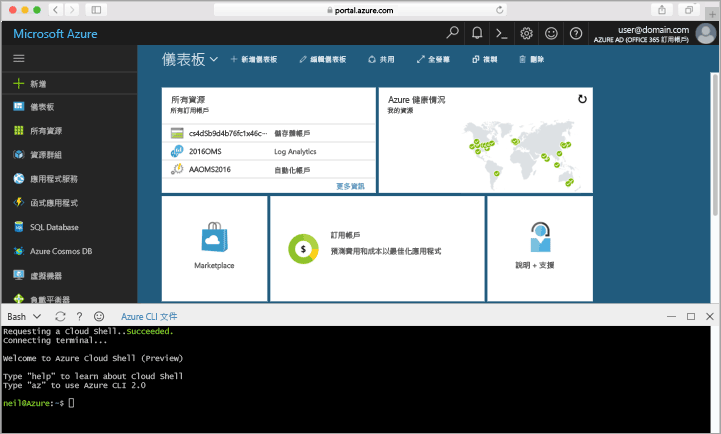

## 啟動 Azure Cloud ShellLaunch Azure Cloud Shell

hello Azure 雲端殼層是免費的 Bash 殼層，您可以直接在 hello Azure 入口網站中執行。hello Azure Cloud Shell is a free Bash shell that you can run directly within hello Azure portal. 它有的 hello Azure CLI 預先安裝和設定 toouse 與您的帳戶。It has hello Azure CLI preinstalled and configured toouse with your account. 按一下 hello**雲端殼層**hello 右上方的 hello 中的 hello 功能表上的按鈕[Azure 入口網站](https://portal.azure.com)。Click hello **Cloud Shell** button on hello menu in hello upper-right of hello [Azure portal](https://portal.azure.com).

hello 按鈕會啟動，您可以使用本主題中的 hello 的所有步驟的 toorun 互動式殼層：hello button launches an interactive shell that you can use toorun all of hello steps in this topic:

