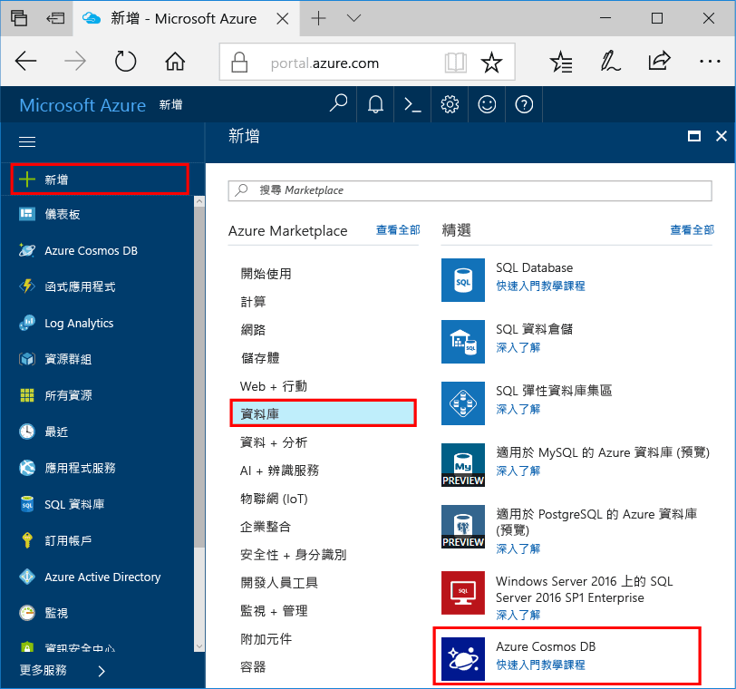

1. 在新視窗中，登入 toohello [Azure 入口網站](https://portal.azure.com/)。In a new window, sign in toohello [Azure portal](https://portal.azure.com/).
2. Hello 左窗格中，按一下 **新增**，按一下 **資料庫**，然後在**Azure Cosmos DB**，按一下 **建立**。In hello left pane, click **New**, click **Databases**, and then under **Azure Cosmos DB**, click **Create**.
   
   

3. 在 hello**新帳戶**刀鋒視窗中，指定您想要用於此 Azure Cosmos DB 帳戶的 hello 組態。In hello **New account** blade, specify hello configuration that you want for this Azure Cosmos DB account. 

    在使用 Azure Cosmos DB 時，您可以選擇下列四種程式設計模型的其中一種︰Gremlin (圖形)、MongoDB、SQL (DocumentDB) 和資料表 (索引鍵-值)，目前各自需要個別的帳戶。With Azure Cosmos DB, you can choose one of four programming models: Gremlin (graph), MongoDB, SQL (DocumentDB), and Table (key-value), each which currently require a separate account.
       
    我們程式 hello Graph API，針對在此 「 快速入門文件，因此請選擇**Gremlin （圖形）**填寫 hello 表單。In this quick-start article, we program against hello Graph API, so choose **Gremlin (graph)** as you fill out hello form. 如果您有來自目錄應用程式的文件資料、索引鍵/值 (資料表) 資料，或從 MongoDB 應用程式移轉而來的資料，請了解 Azure Cosmos DB 可以提供高度可用、全域分散式的資料庫服務平台，供您所有的任務關鍵性應用程式使用。If you have document data from a catalog app, key/value (table) data, or data that's migrated from a MongoDB app, realize that Azure Cosmos DB can provide a highly available, globally distributed database service platform for all your mission-critical applications.

    完成 hello 欄位上 hello**新帳戶**刀鋒視窗中，使用中 hello hello 資訊下列螢幕擷取畫面做為指南-您的值可能不同於 hello hello 螢幕擷取畫面中的值。Complete hello fields on hello **New account** blade, using hello information in hello following screenshot as a guide - your values may be different than hello values in hello screenshot.
 
    

    設定Setting|建議的值Suggested value|說明Description
    ---|---|---
    IDID|唯一值*Unique value*|可識別此 Azure Cosmos DB 帳戶的唯一名稱。A unique name that identifies this Azure Cosmos DB account. 因為*documents.azure.com*是附加的 toohello 您提供 toocreate URI，使用但可辨識的唯一識別碼的識別碼。Because *documents.azure.com* is appended toohello ID that you provide toocreate your URI, use a unique but identifiable ID. hello 識別碼必須包含小寫字母、 數字和 hello 連字號 （-） 字元，而且它必須包含 3 too50 個字元。hello ID must contain only lowercase letters, numbers, and hello hyphen (-) character, and it must contain from 3 too50 characters.
    APIAPI|Gremlin (圖形)Gremlin (graph)|我們進行程式設計的 hello [Graph API](../articles/cosmos-db/graph-introduction.md)本文稍後。We program against hello [Graph API](../articles/cosmos-db/graph-introduction.md) later in this article.|
    訂用帳戶Subscription|*您的訂用帳戶**Your subscription*|hello 的 toouse 此 Azure Cosmos DB 帳戶的 Azure 訂用帳戶。hello Azure subscription that you want toouse for this Azure Cosmos DB account. 
    資源群組Resource Group|*相同的值做為識別碼 hello**hello same value as ID*|hello 新資源群組名稱為您的帳戶的。hello new resource group name for your account. 為了簡單起見，您可以使用名稱相同的 hello 做為您的識別碼。For simplicity, you can use hello same name as your ID. 
    位置Location|*hello 區域最接近 tooyour 使用者**hello region closest tooyour users*|hello 地理位置在哪一個 toohost Azure Cosmos DB 帳戶。hello geographic location in which toohost your Azure Cosmos DB account. 選擇 hello 位置最靠近 tooyour 使用者 toogive 它們 hello 最快的存取 toohello 資料。Choose hello location closest tooyour users toogive them hello fastest access toohello data.

4. 按一下**建立**toocreate hello 帳戶。Click **Create** toocreate hello account.
5. Hello 頂端工具列上，按一下 hello**通知**圖示toomonitor hello 部署程序。On hello top toolbar, click hello **Notifications** icon  toomonitor hello deployment process.

    ![hello Azure 入口網站的 [通知] 窗格](./media/cosmos-db-create-dbaccount-graph/notification.png)

6.  當 hello 通知視窗表示 hello 部署成功，請關閉 hello 通知視窗和新的帳戶開啟 hello 從 hello**所有資源**hello 儀表板上的磚。When hello Notifications window indicates hello deployment succeeded, close hello notification window and open hello new account from hello **All Resources** tile on hello Dashboard. 

    
