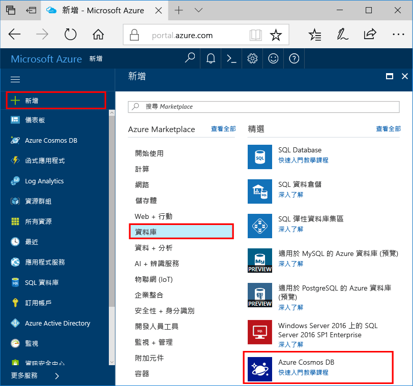

1. 在新視窗中，登入 toohello [Azure 入口網站](https://portal.azure.com/)。
2. Hello 左窗格中，按一下 **新增**，按一下 **資料庫**，然後在**Azure Cosmos DB**，按一下 **建立**。
   
   

3. 在 hello**新帳戶**刀鋒視窗中，指定您想要用於此 Azure Cosmos DB 帳戶的 hello 組態。 

    在使用 Azure Cosmos DB 時，您可以選擇下列四種程式設計模型的其中一種︰Gremlin (圖形)、MongoDB、SQL (DocumentDB) 和資料表 (索引鍵-值)，目前各自需要個別的帳戶。
    
    在這個快速入門文章中我們 hello DocumentDB API 進行程式設計，因此請選擇**SQL (DocumentDB)**填寫 hello 表單。 如果您有用於社交媒體應用程式的圖形資料、索引鍵/值 (資料表) 資料，或從 MongoDB 應用程式移轉而來的資料，請了解 Azure Cosmos DB 可以提供高度可用、全域分散式的資料庫服務平台來供您所有的任務關鍵性應用程式使用。

    完成 hello 欄位上 hello**新帳戶**刀鋒視窗中，您的值使用 hello 下列指南-螢幕擷取畫面中的 hello 資訊可能會與 hello 螢幕擷取畫面中的 hello 值不同。
 
    

    設定|建議的值|說明
    ---|---|---
    ID|唯一值|可識別此 Azure Cosmos DB 帳戶的唯一名稱。 因為*documents.azure.com*是附加的 toohello 您提供 toocreate URI，使用但可辨識的唯一識別碼的識別碼。 hello 識別碼只能包含小寫字母、 數字和 hello 連字號 （-） 字元，而且它必須包含 3 too50 字元。
    API|SQL (DocumentDB)|我們進行程式設計的 hello [DocumentDB API](../articles/documentdb/documentdb-introduction.md)本文稍後。|
    訂用帳戶|*您的訂用帳戶*|hello 的 toouse 此 Azure Cosmos DB 帳戶的 Azure 訂用帳戶。 
    資源群組|*相同的值做為識別碼 hello*|hello 新資源群組名稱為您的帳戶的。 為了簡單起見，您可以使用名稱相同的 hello 做為您的識別碼。 
    位置|*hello 區域最接近 tooyour 使用者*|hello 地理位置在哪一個 toohost Azure Cosmos DB 帳戶。 選擇最接近它們 hello 最快的存取 toohello 資料 tooyour 使用者 toogive hello 位置。
4. 按一下**建立**toocreate hello 帳戶。
5. Hello 頂端工具列上，按一下 hello**通知**圖示toomonitor hello 部署程序。

    ![hello Azure 入口網站的 [通知] 窗格](./media/cosmos-db-create-dbaccount-graph/azure-documentdb-nosql-notification.png)

6.  當 hello 通知視窗表示 hello 部署成功，請關閉 hello 通知視窗和新的帳戶開啟 hello 從 hello**所有資源**hello 儀表板上的磚。 

    
 
