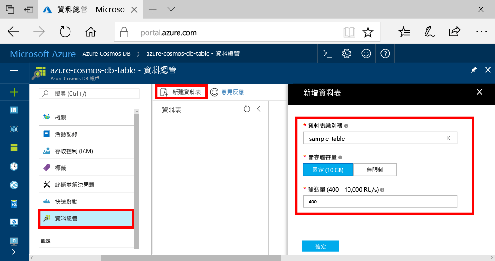

您現在可以使用資料總管 toocreate 資料表，並加入資料 tooyour 資料庫。 

1. 在 hello Azure 入口網站，在 hello 瀏覽功能表中，按一下 **資料總管 （預覽）**。 
2. 在 hello 資料總管刀鋒視窗中，按一下 **新資料表**，然後使用下列資訊的 hello hello 頁面中填入。

    

    設定|建議的值|說明
    ---|---|---
    資料表識別碼|sample-table|新的資料表中的 hello 識別碼。 資料表名稱具有 hello 相同字元做為資料庫 id 的需求。 資料庫名稱的長度必須介於 1 到 255 個字元，且不能包含 `/ \ # ?` 或尾端空格。
    儲存體容量| 10 GB|保留 hello 預設值。 這是 hello hello 資料庫儲存容量。
    Throughput|400 RU|保留 hello 預設值。 您可以向上擴充 hello[輸送量](../articles/cosmos-db/request-units.md)稍後如果您想要 tooreduce 延遲。

3. 一旦填寫 hello 表單，按一下 **確定**。
