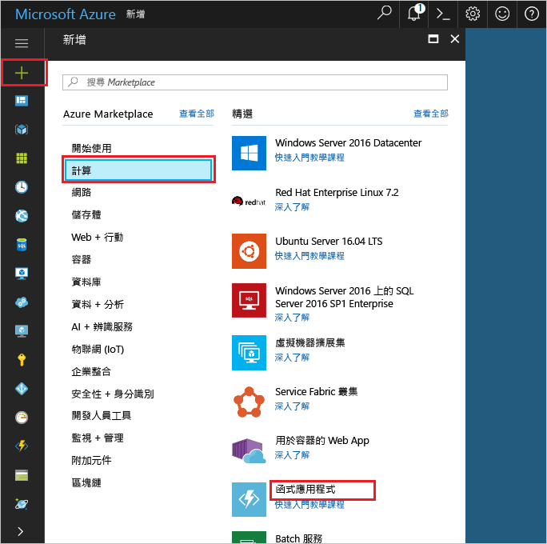

1. 按一下 hello**新增**hello 的左上角 hello Azure 入口網站上找到的按鈕。Click hello **New** button found on hello upper left-hand corner of hello Azure portal.

1. 按一下 [計算] > [函式應用程式]，接著選取您的**訂用帳戶**。Click **Compute** > **Function App**, select your **Subscription**. 然後，使用 hello 資料表中所指定的 hello 函式應用程式設定。Then, use hello function app settings as specified in hello table.

    

    | 設定Setting      | 建議的值Suggested value  | 說明Description                                        |
    | ------------ |  ------- | -------------------------------------------------- |
    | **應用程式名稱****App name** | 全域唯一的名稱Globally unique name | 用以識別新函式應用程式的名稱。Name that identifies your new function app. | 
    | **[資源群組](../articles/azure-resource-manager/resource-group-overview.md)****[Resource Group](../articles/azure-resource-manager/resource-group-overview.md)** |  myResourceGroupmyResourceGroup | Hello 新資源群組中哪個 toocreate 函式應用程式名稱。Name for hello new resource group in which toocreate your function app. | 
    | **[主控方案](../articles/azure-functions/functions-scale.md)****[Hosting plan](../articles/azure-functions/functions-scale.md)** |   取用方案Consumption plan | 定義如何將資源配置 tooyour 函式應用程式的主控方案。Hosting plan that defines how resources are allocated tooyour function app. 在預設的 hello**耗用量計劃**，動態函式所加入的資源。In hello default **Consumption Plan**, resources are added dynamically as required by your functions. 您只需支付 hello 函式執行的時間。You only pay for hello time your functions run.   |
    | **位置****Location** | 西歐West Europe | 選擇與您接近的位置，或選擇與您的函式將會存取之其他服務接近的位置。Choose a location near you or near other services your functions will access. |
    | **[儲存體帳戶](../articles/storage/common/storage-create-storage-account.md#create-a-storage-account)****[Storage account](../articles/storage/common/storage-create-storage-account.md#create-a-storage-account)** |  全域唯一的名稱Globally unique name |  Hello 函式應用程式所使用新儲存體帳戶的名稱。Name of hello new storage account used by your function app. 儲存體帳戶名稱必須介於 3 到 24 個字元的長度，而且只能包含數字和小寫字母。Storage account names must be between 3 and 24 characters in length and may contain numbers and lowercase letters only. 您也可以使用現有帳戶。You can also use an existing account. |

1. 按一下**建立**tooprovision 和部署 hello 新函式應用程式。Click **Create** tooprovision and deploy hello new function app.
