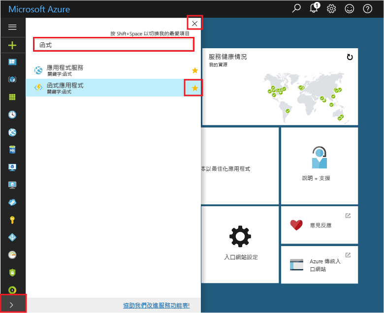
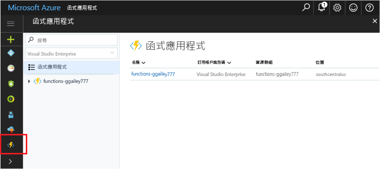

## 新增函式應用程式 tooyour 入口網站的 [我的最愛]Add Function Apps tooyour portal favorites 

如果您尚未這樣做，請加入函式應用程式 tooyour 我的最愛 hello Azure 入口網站中。If you haven't already done so, add Function Apps tooyour favorites in hello Azure portal. 這可讓您更輕鬆 toofind 函式應用程式。This makes it easier toofind your function apps. 如果有這麼做，請略過 toohello 下一節。If you have already done this, skip toohello next section. 

1. 登入 toohello [Azure 入口網站](https://portal.azure.com/)。Log in toohello [Azure portal](https://portal.azure.com/).

2. 按一下 所有服務，型別 hello 下方左 tooexpand hello 箭號`Functions`hello 中**篩選**欄位，並把 hello 星狀太**函式應用程式**。Click hello arrow at hello bottom left tooexpand all services, type `Functions` in hello **Filter** field, and then click hello star next too**Function Apps**.  
 
    

    這會將 hello hello 入口網站左側的 hello 函式圖示 toohello 功能表。This adds hello Functions icon toohello menu on hello left of hello portal.

3. 關閉 [hello] 功能表，然後捲動 toohello 底部 toosee hello 函式圖示。Close hello menu, then scroll down toohello bottom toosee hello Functions icon. 按一下此圖示 toosee 所有函式應用程式清單。Click this icon toosee a list of all your function apps. 按一下您與此應用程式中的函式的函式應用程式 toowork。Click your function app toowork with functions in this app. 
 
    
 
     