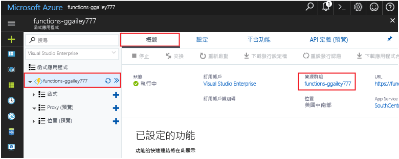

此集合中的其他快速入門會建置在本快速入門。Other quick starts in this collection build upon this quick start. 如果您計劃 toocontinue toowork 與後續的快速啟動或 hello 教學課程，請不要清除 在這個快速建立 hello 資源開始。If you plan toocontinue on toowork with subsequent quick starts or with hello tutorials, do not clean up hello resources created in this quick start. 

如果您不打算 toocontinue，按一下 hello**資源群組**hello 函式的應用程式中 hello 入口網站，然後按一下**刪除**。If you do not plan toocontinue, click hello **Resource group** for hello function app in hello portal, and then click **Delete**. 

