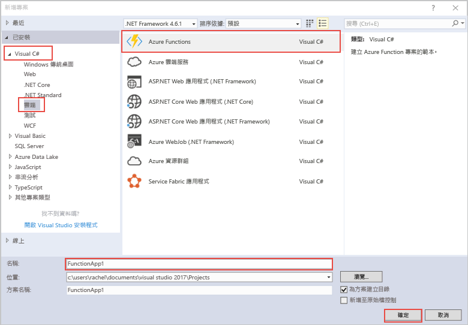

在 Visual Studio 中的 hello Azure 函式專案範本會建立可以在 Azure 中的已發行的 tooa 函式應用程式的專案。 函式應用程式可讓您將多個函式群組為邏輯單位，以方便您管理、部署和共用資源。   

1. 中的 hello 專案節點上以滑鼠右鍵按一下**方案總管] 中**，然後選擇 [**新增** > **新項目**。 選擇**Azure 函式**hello 對話方塊。

2. 在 [hello**新專案**] 對話方塊中，展開**Visual C#** > **雲端**節點中，選取**Azure 函式**，輸入**名稱**專案，然後按一下**確定**。 hello 函式應用程式名稱必須是有效為 C# 命名空間，因此不會使用底線、 連字號或任何其他非英數字元。 

    
