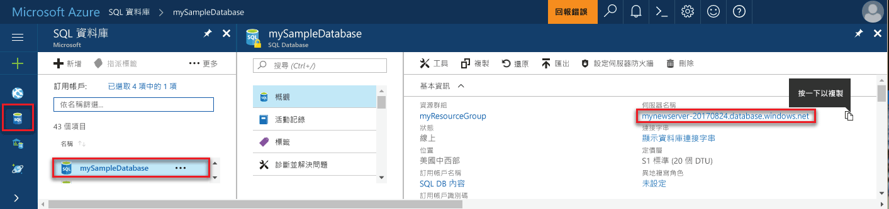

## 登入 toohello Azure 入口網站Log in toohello Azure portal

登入 toohello [Azure 入口網站](https://portal.azure.com/)。Log in toohello [Azure portal](https://portal.azure.com/).

## 建立空白的 SQL database 使用 hello Azure 入口網站Create a blank SQL database using hello Azure portal

Azure SQL Database 會使用一組定義的[計算和儲存體資源](../articles/sql-database/sql-database-service-tiers.md)建立。An Azure SQL database is created with a defined set of [compute and storage resources](../articles/sql-database/sql-database-service-tiers.md). hello 資料庫內建立[Azure 資源群組](../articles/azure-resource-manager/resource-group-overview.md)和[Azure SQL Database 邏輯伺服器](../articles/sql-database/sql-database-features.md)。hello database is created within an [Azure resource group](../articles/azure-resource-manager/resource-group-overview.md) and in an [Azure SQL Database logical server](../articles/sql-database/sql-database-features.md). 

請遵循這些步驟 toocreate 空白的 SQL 資料庫。Follow these steps toocreate a blank SQL database. 

1. 按一下 hello**新增**hello 的左上角 hello Azure 入口網站上找到的按鈕。Click hello **New** button found on hello upper left-hand corner of hello Azure portal.

2. 選取**資料庫**從 hello**新增**頁面上，並選取**SQL Database**從 hello**資料庫**頁面。Select **Databases** from hello **New** page, and select **SQL Database** from hello **Databases** page. 

   

3. 填寫 hello SQL Database 表單以下列資訊，hello hello 前面影像所示：Fill out hello SQL Database form with hello following information, as shown on hello preceding image:   

   | 設定Setting | 建議的值Suggested value | 說明Description |
   | --------| --------------- | ----------- | 
   | **資料庫名稱****Database name** | mySampleDatabasemySampleDatabase | 如需有效的資料庫名稱，請參閱[資料庫識別碼](https://docs.microsoft.com/sql/relational-databases/databases/database-identifiers)。For valid database names, see [Database Identifiers](https://docs.microsoft.com/sql/relational-databases/databases/database-identifiers). | 
   | **訂用帳戶****Subscription** | 您的訂用帳戶Your subscription  | 如需訂用帳戶的詳細資訊，請參閱[訂用帳戶](https://account.windowsazure.com/Subscriptions)。For details about your subscriptions, see [Subscriptions](https://account.windowsazure.com/Subscriptions). |
   | **資源群組****Resource group** | myResourceGroupmyResourceGroup | 如需有效的資源群組名稱，請參閱[命名規則和限制](https://docs.microsoft.com/azure/architecture/best-practices/naming-conventions)。For valid resource group names, see [Naming rules and restrictions](https://docs.microsoft.com/azure/architecture/best-practices/naming-conventions). |
   | **選取來源****Select source** | 空白資料庫Blank database | 指定應建立空白資料庫。Specifies that a blank database should be created. |
   ||||

4. 按一下**伺服器**toocreate 及設定新的伺服器，為您新的資料庫。Click **Server** toocreate and configure a new server for your new database. 填寫 hello**表單的新伺服器**以 hello 下列資訊：Fill out hello **New server form** with hello following information: 

   | 設定Setting | 建議的值Suggested value | 說明Description |
   | --------| --------------- | ----------- | 
   | **伺服器名稱****Server name** | 任何全域唯一名稱。Any globally unique name. | 如需有效的伺服器名稱，請參閱[命名規則和限制](https://docs.microsoft.com/azure/architecture/best-practices/naming-conventions)。For valid server names, see [Naming rules and restrictions](https://docs.microsoft.com/azure/architecture/best-practices/naming-conventions). | 
   | **伺服器管理員登入****Server admin login** | 任何有效名稱。Any valid name. | 如需有效的登入名稱，請參閱[資料庫識別碼](https://docs.microsoft.com/sql/relational-databases/databases/database-identifiers)。For valid login names, see [Database Identifiers](https://docs.microsoft.com/sql/relational-databases/databases/database-identifiers).|
   | **密碼****Password** | 任何有效密碼。Any valid password. | 您的密碼必須至少為八個字元，且必須包含下列類別目錄的 hello 的其中三種字元： 大寫字母、 小寫字元、 數字和非英數字元。Your password must have at least eight characters and must contain characters from three of hello following categories: upper case characters, lower case characters, numbers, and non-alphanumeric characters. |
   | **位置****Location** | 任何有效位置。Any valid location. | 如需區域的相關資訊，請參閱 [Azure 區域](https://azure.microsoft.com/regions/)。For information about regions, see [Azure Regions](https://azure.microsoft.com/regions/). |
   ||||

   

5. 按一下 [選取] 。Click **Select**.

6. 按一下**定價層**toospecify hello 服務層和效能層級的新資料庫。Click **Pricing tier** toospecify hello service tier and performance level for your new database. 針對此快速入門，選取 [20 DTUs (20 個 DTU)] 和 [250] GB 儲存體。For this tutorial, select **20 DTUs** and **250** GB of storage.

   

7. 按一下 [Apply (套用)] 。Click **Apply**.  

8. 選取**定序**hello （適用於此教學課程中，使用 hello 預設值） 的空白資料庫。Select a **collation** for hello blank database (for this tutorial, use hello default value). 如需定序的詳細資訊，請參閱[定序](https://docs.microsoft.com/sql/t-sql/statements/collations)。For more information about collations, see [Collations](https://docs.microsoft.com/sql/t-sql/statements/collations)

9. 按一下**建立**tooprovision hello 資料庫。Click **Create** tooprovision hello database. 提供有關分鐘半 toocomplete 採用。Provisioning takes about a minute and a half toocomplete. 

10. 在 [hello] 工具列上按一下**通知**toomonitor hello 部署程序。On hello toolbar, click **Notifications** toomonitor hello deployment process.

   

## 建立使用 hello Azure 入口網站的伺服器層級防火牆規則Create a server-level firewall rule using hello Azure portal

hello SQL Database 服務會在 hello 伺服器層級建立防火牆。hello SQL Database service creates a firewall at hello server-level. 一開始 hello 防火牆會阻止外部工具和應用程式從 toohello 伺服器或 tooany hello 伺服器上的資料庫連接。Initially hello firewall prevents external tools and applications from connecting toohello server, or tooany databases on hello server. 之後建立 tooopen 特定 IP 位址的防火牆規則允許的連線。Connections are allowed after a firewall rule is created tooopen specific IP addresses. 請遵循這些步驟 toocreate [SQL Database 伺服器層級防火牆規則](../articles/sql-database/sql-database-firewall-configure.md)用戶端的 IP 位址和 tooenable hello SQL Database 防火牆的 IP 位址僅透過外部連線能力。Follow these steps toocreate a [SQL Database server-level firewall rule](../articles/sql-database/sql-database-firewall-configure.md) for your client's IP address, and tooenable external connectivity through hello SQL Database firewall for your IP address only. 

> [!NOTE]
> Azure SQL Database 會透過連接埠 1433 通訊。Azure SQL Database communicates over port 1433. 只有在您的網路的 hello 防火牆允許經由連接埠 1433年傳出流量之後，您可以連接 tooSQL 資料庫。You can connect tooSQL Database only after hello firewall of your network allows outbound traffic through port 1433.

1. Hello 部署完成之後，請按一下**SQL 資料庫**從 hello 左側功能表，然後按一下**mySampleDatabase**上 hello **SQL 資料庫**頁面。After hello deployment completes, click **SQL databases** from hello left-hand menu and then click **mySampleDatabase** on hello **SQL databases** page. hello 概觀 頁面的資料庫會開啟，顯示您 hello 完全符合規定的伺服器名稱 (例如**mynewserver20170313.database.windows.net**)，並提供進一步組態的選項。hello overview page for your database opens, showing you hello fully qualified server name (such as **mynewserver20170313.database.windows.net**) and provides options for further configuration. 將這個完整伺服器名稱複製起來，以供稍後使用。Copy this fully qualified server name for use later.

   > [!IMPORTANT]
   > 您需要此完整的伺服器名稱 tooconnect tooyour 伺服器和其後續的快速入門中的資料庫。You need this fully qualified server name tooconnect tooyour server and its databases in subsequent quick starts.
   > 

    

2. 按一下**設定伺服器防火牆**hello 工具列 hello 如上圖所示。Click **Set server firewall** on hello toolbar as shown in hello previous image. hello**防火牆設定**hello SQL 資料庫伺服器 頁面隨即開啟。hello **Firewall settings** page for hello SQL Database server opens. 

    

3. 按一下**新增用戶端 IP** hello 工具列 tooadd 上目前的 IP 位址 tooa 新防火牆規則。Click **Add client IP** on hello toolbar tooadd your current IP address tooa new firewall rule. 防火牆規則可以針對單一 IP 位址或 IP 位址範圍開啟連接埠 1433。A firewall rule can open port 1433 for a single IP address or a range of IP addresses.

4. 按一下 [儲存] 。Click **Save**. 為開啟通訊埠 1433 hello 邏輯伺服器上的目前的 IP 位址建立伺服器層級防火牆規則。A server-level firewall rule is created for your current IP address opening port 1433 on hello logical server.

    

4. 按一下**確定**，然後關閉 hello**防火牆設定**頁面。Click **OK** and then close hello **Firewall settings** page.

您現在可以使用工具，例如 SQL Server Management Studio (SSMS) 連接 toohello Azure SQL Database 伺服器和資料庫。You can now connect toohello Azure SQL Database server and its databases by using a tool such as SQL Server Management Studio (SSMS). hello 連接是來自此 IP 位址，並使用先前建立的 hello 伺服器系統管理員帳戶。hello connection is from this IP address, and it uses hello server admin account created previously.

> [!IMPORTANT]
> 根據預設，透過 hello SQL Database 防火牆會啟用所有 Azure 服務。By default, access through hello SQL Database firewall is enabled for all Azure services. 按一下**OFF**上所有的 Azure 服務的這個頁面 toodisable。Click **OFF** on this page toodisable for all Azure services.

## 取得使用 hello Azure 入口網站的連接字串值Get connection string values using hello Azure portal

取得 hello Azure 入口網站中的 hello Azure SQL Database 伺服器的完整的伺服器名稱。Get hello fully qualified server name for your Azure SQL Database server in hello Azure portal. 您使用 hello 完整的伺服器名稱 tooconnect tooyour 伺服器使用 SQL Server Management Studio。You use hello fully qualified server name tooconnect tooyour server using SQL Server Management Studio.

1. 登入 toohello [Azure 入口網站](https://portal.azure.com/)。Log in toohello [Azure portal](https://portal.azure.com/).

2. 選取**SQL 資料庫**從 hello 左側功能表中，按一下您的資料庫上 hello **SQL 資料庫**頁面。Select **SQL Databases** from hello left-hand menu, and click your database on hello **SQL databases** page. 

3. 在 [hello **Essentials** hello Azure 入口網站頁面，為您的資料庫中] 窗格找到並複製 hello**伺服器名稱**。In hello **Essentials** pane in hello Azure portal page for your database, locate and then copy hello **Server name**.

    
